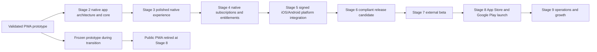
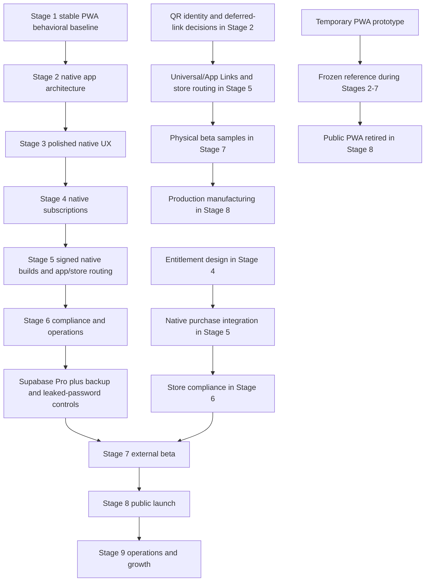

# Bookmarkt Product Roadmap

| Field | Value |
| --- | --- |
| Roadmap version | 1.2 |
| Status | Active |
| Product owner | Bookmarkt product owner |
| Current stage | Stage 1 - Stabilization |
| Current gate state | Seven-day production stability observation |
| Observation window | August 16, 2026 at 10:55 MDT through August 23, 2026 at 10:55 MDT |
| Last updated | August 16, 2026 |

This document is the authoritative product roadmap for Bookmarkt. Execution and
approval rules are defined in [STAGE_GATES.md](STAGE_GATES.md), and material
roadmap decisions are recorded in [DECISION_LOG.md](DECISION_LOG.md).

## 1. Product goal

**Build a native iOS and Android application that modernizes the physical
bookmark by using its QR code to open Bookmarkt when installed or route the
reader to the correct app store when Bookmarkt is not installed.**

The complete reading experience belongs in the native application. The current
PWA exists to validate the concept quickly and provide a behavioral reference
during development; it is not a launch channel. A Bookmarkt-controlled HTTPS
smart-link service remains necessary for universal/App Links, platform-specific
store routing, deferred QR context when applicable, privacy, support, and account
obligations. It does not provide the Bookmarkt reading application.

Information belongs to the reader's account, not to one phone or physical
bookmark.

## 2. Product promise

A reader can:

1. Scan a Bookmarkt QR code.
2. Open Bookmarkt directly when it is installed.
3. Reach the Apple App Store or Google Play when it is not installed.
4. Install the app and recover any supported deferred QR context.
5. Create an account or sign in securely.
6. Add and organize books they are reading.
7. Record reading progress and personal notes manually.
8. Use only the AI capabilities included in their active paid tier: AI text
   summary, AI character mapping, and/or AI image generation.
9. Keep AI text, character, and image output constrained to their reading
   boundary and save only the output they approve.
10. Manually build and maintain book-specific character maps.
11. Store book metadata and personal or entitled AI-generated images.
12. Return from another supported phone and recover the same account data.
13. Understand and control their subscription, privacy, data, and account.

## 3. Product principles

- **App-first launch product.** All reading workflows ship in the native iOS and
  Android applications.
- **Prototype, not permanent PWA.** The PWA remains a temporary validation and
  behavior-reference environment until the native product replaces it.
- **One shared native product core.** iOS and Android should share domain behavior
  and backend services instead of becoming separate products.
- **Install-aware QR routing.** A durable smart link opens the installed app or
  sends an uninstalled mobile user to the correct platform store.
- **Account-centered continuity.** Reading data follows the authenticated user.
- **Privacy by default.** Cross-account access is prohibited and verified, not
  merely assumed.
- **Paid AI is server-authorized.** The backend checks the active subscription
  tier and requested feature before any AI provider call. A client-side paywall
  is never the security boundary.
- **Limited v1 AI catalog.** Paid tiers may include only AI text summary, AI
  character mapping, and AI image generation unless a later material decision
  expands the catalog.
- **Spoiler-aware AI.** AI output respects the reader's recorded boundary and
  offers a clear reporting path.
- **Human-reviewed AI feedback.** User reports inform evaluation and product
  improvements; they do not automatically overwrite data or retrain a model.
- **Accessible and resilient.** Core reading workflows work on mobile devices,
  degraded networks, and assistive technologies.
- **Stage-gated delivery.** A later stage cannot silently redefine or bypass an
  earlier gate.
- **Reversible releases.** Schema, configuration, and application changes require
  deployment and rollback plans.
- **Permanent QR destinations.** Printed codes should resolve through a
  Bookmarkt-controlled HTTPS smart-link service, never a disposable deployment
  URL or direct store URL that cannot evolve.

## 4. Initial v1 product boundaries

Bookmarkt v1 is a personal reading companion. It is not initially:

- An ebook reader or book-content marketplace.
- A public social network.
- A source of licensed full-book text.
- An autonomous AI correction or model-training platform.
- An open-ended catalog of AI tools beyond text summary, character mapping, and
  image generation.
- A public web or PWA reading application.

The minimal website and smart-link service may display installation guidance on
unsupported/desktop devices, but they do not expose the reading product.

Changes to these boundaries require the roadmap change process.

## 5. Core user journey

```mermaid
flowchart LR
    A[Scan physical bookmark QR] --> B[Bookmarkt smart link]
    B --> C{Native app installed?}
    C -->|Yes| D[Open app through universal/App Link]
    C -->|No| E{Mobile platform}
    E -->|iOS| F[Open Apple App Store]
    E -->|Android| G[Open Google Play]
    E -->|Unsupported/desktop| H[Show installation information]
    F --> I[Install and open Bookmarkt]
    G --> I
    I --> J[Restore deferred QR context if supported]
    D --> K{Authenticated?}
    J --> K
    K -->|No| L[Create account or sign in]
    K -->|Yes| M[Open library]
    L --> M
    M --> N[Select or add book]
    N --> O[Record reading boundary]
    O --> P{Entry type}
    P -->|Manual| Q[Write and save notes]
    Q --> R[Optional manual character updates/image uploads]
    P -->|AI-assisted| S{Paid subscription active?}
    S -->|No| T[Show eligible paid tiers]
    T --> Q
    S -->|Yes| U[Load server-authoritative tier entitlements]
    U --> V{Requested AI feature included?}
    V -->|No| T
    V -->|Yes| W{Entitled AI feature}
    W -->|Text summary| X[Generate reading-bounded text summary]
    W -->|Character mapping| Y[Generate reading-bounded character map]
    W -->|Image generator| Z[Generate reading-bounded AI image]
    X --> AA[Review and save approved AI output]
    Y --> AA
    Z --> AA
    AA --> AB[Store user records/private image object]
    R --> AC[Sync securely to account]
    AB --> AC
    AC --> AD[Resume in the native app]
```

## 6. Platform evolution

Stage 2 begins the native application rebuild. The PWA remains temporarily
available as a frozen prototype/reference while the native product reaches
parity. Stage 5 completes platform integration and signed distribution. Stage 8
retires the public PWA reading experience when the native apps launch.

## 7. Roadmap status

| Phase | Name | Status | Exit outcome |
| --- | --- | --- | --- |
| Foundation | Functional prototype | Complete | QR-accessible production PWA proved the product concept |
| Stage 1 | Stabilization | Observation | Reliable and secure baseline with seven clean days |
| Stage 2 | Architecture rebuild | Planned | Maintainable, tested native application core |
| Stage 3 | Polished UI/UX | Planned | Accessible, branded, validated native experience |
| Stage 4 | Monetization and accounts | Planned | Store-compliant subscriptions and entitlement system |
| Stage 5 | Native iOS/Android packaging | Planned | Signed internal builds on real devices |
| Stage 6 | Compliance and launch operations | Planned | Legally and operationally ready external-beta candidate |
| Stage 7 | External beta | Planned | Evidence that real users and operations are launch-ready |
| Stage 8 | App-store launch | Planned | Public iOS/Android release and retirement of the PWA product |
| Stage 9 | Operations and growth | Planned | Sustainable ongoing product reliability and growth |

## 8. Foundation history - completed

This work predates formal gate tracking but forms the Stage 1 baseline.

- [x] Built a functional HTML/CSS/JavaScript PWA.
- [x] Connected Supabase Auth, Postgres, Storage, and Row Level Security.
- [x] Added account creation, login, logout, and persisted sessions.
- [x] Added books, metadata, reading progress, notes, and images.
- [x] Added AI summaries with configurable detail.
- [x] Added book-specific character maps with configurable detail.
- [x] Added spoiler boundaries, AI feedback, spoiler reports, analytics, and
      generation audit records.
- [x] Added Open Library metadata lookup and fallback handling.
- [x] Deployed the production PWA through Netlify.
- [x] Confirmed installation and basic use on a phone.

## 9. Stage 1 - Stabilization

**Status:** Observation

**Purpose:** Prove that the current production baseline is reliable, private,
secure against obvious abuse, and safe to use as the behavioral reference for
the native application rebuild. Stage 1 validates behavior and backend controls;
it does not approve the PWA as a launch channel.

### Completed work

- [x] Promoted the working PWA to the production branch and URL.
- [x] Fixed stale authentication/session handling behind save timeouts.
- [x] Removed the Auth callback deadlock caused by awaiting database work while
      the Supabase Auth lock was held.
- [x] Prevented stale book requests from overwriting the newly selected book's
      entries, characters, or images.
- [x] Applied and reconciled all production database migrations.
- [x] Verified RLS on user data, analytics, AI audit data, reports, and Storage.
- [x] Made the image bucket private and changed the application to signed URLs.
- [x] Verified a second account cannot see the first account's data.
- [x] Enforced a 12-character password with uppercase, lowercase, number, and
      symbol requirements.
- [x] Required authenticated AI requests.
- [x] Added atomic limits of 30 AI generations per user per UTC day and 500
      generations across the project per UTC day.
- [x] Added AI outcome, error, usage, and latency logging.
- [x] Documented monitoring and recovery operations.
- [x] Passed phone tests for logout/login, data recovery, adding and editing a
      book, rapid book switching, AI generation, image display/upload/edit/delete,
      and weak-password rejection.

### Remaining work

- [ ] Complete seven consecutive days without a P0 or P1 defect.
- [ ] Record the formal Stage 1 exit decision.

The stability window began August 16, 2026 at 10:55 MDT (16:55 UTC). Seven
consecutive 24-hour periods complete on August 23, 2026 at 10:55 MDT (16:55 UTC);
that is the earliest exit review. See
[gates/STAGE_1_REVIEW.md](gates/STAGE_1_REVIEW.md).

### Deferred, non-blocking controls

The following controls are intentionally moved to the Stage 7 entry gate. They
do not block Stages 2-6:

- Supabase Pro daily database backups with seven-day retention.
- Supabase Pro leaked-password protection.

Upgrade earlier if real-user data becomes irreplaceable, external users are
invited, or Free-plan capacity/pausing becomes material.

### Stage 1 exit gate

- All production-phone acceptance flows pass.
- Database and Storage isolation are verified.
- AI authentication, cost limits, and operational logging are active.
- The PWA is accepted only as a temporary prototype and behavioral reference.
- No unresolved P0 or P1 defect exists.
- The full seven-day stability window is complete.
- The product owner records an explicit `GO` decision.

## 10. Stage 2 - Architecture rebuild

**Status:** Planned

**Purpose:** Build the maintainable, typed, tested native application foundation
for iOS and Android while preserving validated prototype behavior and the shared
Supabase backend.

### Entry gate

- Stage 1 has a recorded `GO` decision.
- Current production behavior is captured as acceptance criteria.
- A rollback path to the validated Stage 1 production build exists.

### Work plan

#### Product and architecture decisions

- [ ] Decide whether QR codes are generic product launchers or uniquely identify
      a physical bookmark. Document account-linking, replacement, transfer, and
      manufacturing implications before changing the data model.
- [ ] Confirm the native target architecture. The recommended baseline is React
      Native with Expo, TypeScript, and Supabase. Compare alternatives such as
      Flutter or Capacitor against native UX, maintainability, app-store
      requirements, and the app-only launch scope before approval.
- [ ] Select the universal/App Link, platform store-routing, and deferred
      deep-link approach. The QR destination must remain under Bookmarkt control.
- [ ] Define domain boundaries for authentication, library, progress, entries,
      AI, characters, images, reporting, analytics, and subscriptions.
- [ ] Define a server-authoritative entitlement boundary shared by all three AI
      feature services; the native client can request but cannot grant access.
- [ ] Define environment, secret, configuration, and deployment ownership.
- [ ] Record architecture decisions in the decision log or dedicated ADRs.

#### Application foundation

- [ ] Create the approved native iOS/Android application workspace with strict
      type-checking.
- [ ] Establish native navigation, authenticated screens, reusable components,
      services, state/query management, types, utilities, and themes.
- [ ] Generate and use Supabase database types.
- [ ] Isolate Supabase behind typed service/repository modules.
- [ ] Add validated environment and build-profile configuration for local,
      preview/internal, and production applications.
- [ ] Add protected native navigation and deterministic session restoration.
- [ ] Use platform-appropriate secure storage for native session material.
- [ ] Preserve the rule that database work is deferred outside Auth callbacks.
- [ ] Make selected-book state and request cancellation/versioning explicit so
      stale responses cannot cross book boundaries.

#### Feature-parity migration

- [ ] Migrate signup, login, logout, recovery, session expiry, and re-login.
- [ ] Migrate library, book metadata, and Open Library lookup.
- [ ] Migrate reading progress and manual entries.
- [ ] Migrate bounded AI text summaries and AI usage messaging behind an
      entitlement-ready service.
- [ ] Migrate manual character maps and character-detail controls.
- [ ] Define bounded AI character-mapping and AI image-generation contracts,
      artifact metadata, approval state, and provider-independent interfaces.
- [ ] Store approved AI text/character output in user-owned RLS rows and
      AI-generated images in the user's private Storage folder.
- [ ] Migrate private image upload, signing, display, edit, and deletion.
- [ ] Migrate analytics, spoiler reporting, and AI issue reporting.
- [ ] Add report lifecycle fields and typed services for status, priority,
      assignment, resolution notes, and resolution timestamps.
- [ ] Preserve legacy image-path compatibility until every row is migrated.

#### Reliability and operations

- [ ] Standardize loading, empty, success, timeout, offline, and error states.
- [ ] Replace developer-facing alerts with a shared notification system.
- [ ] Define native installation, app-version compatibility, over-the-air update
      boundaries, store update, offline, and stale-client behavior.
- [ ] Freeze the PWA to critical stabilization fixes and document its transition,
      access restriction, service-worker cleanup, and final retirement plan.
- [ ] Build the minimal smart-link/store-routing service separately from the
      reading application.
- [ ] Add structured client error and performance telemetry with privacy limits.
- [ ] Design and automate export/backup of actual Storage image objects; database
      backups only preserve Storage metadata.
- [ ] Add migration, deployment, feature-flag, rollback, and data-reconciliation
      procedures.

#### Quality system

- [ ] Add unit tests for domain rules and validation.
- [ ] Add integration tests for Supabase service boundaries.
- [ ] Add native component and integration tests for authentication, book CRUD,
      book switching, entries, AI error handling, character maps, and private
      images.
- [ ] Add service tests proving denied AI requests do not reach any AI provider
      and approved artifacts cannot cross account boundaries.
- [ ] Add iOS and Android device automation for critical journeys.
- [ ] Test smart-link platform detection and store-routing behavior.
- [ ] Add explicit cross-account isolation tests against a safe test project.
- [ ] Add type-check, test, build, and migration checks to pull-request CI.
- [ ] Add internal native preview builds and a release checklist; retain Netlify
      only for the temporary prototype and minimal web endpoints.
- [ ] Define native cold-start, QR-to-app, screen-load, and interaction budgets.

#### Cutover

- [ ] Run old and new implementations against the same acceptance checklist.
- [ ] Resolve all parity gaps and migration risks.
- [ ] Prove the native alpha through controlled internal builds with rollback.
- [ ] Keep the legacy PWA available only as the temporary validated prototype
      until native beta/launch readiness; do not expand it into the final product.
- [ ] Approve a retirement runbook covering routing, service-worker cleanup,
      cached installations, user communication, and backend/data continuity.

### Stage 2 exit gate

- The native application alpha runs on both iOS and Android development/internal
  builds.
- Every relevant Stage 1 user journey has native feature parity.
- The temporary PWA scope is frozen and its retirement runbook is approved.
- Type-check, automated tests, and native builds pass in CI.
- Auth restoration, cross-account isolation, private images, book switching, and
  AI generation pass automated and iOS/Android device tests.
- Schema and configuration changes are reproducible from version control.
- Native distribution/rollback, version compatibility, smart-link routing, and
  Storage-object recovery procedures are documented and exercised safely.
- No unresolved P0 or P1 defect exists.
- The product owner records a `GO` decision.

## 11. Stage 3 - Polished UI/UX

**Status:** Planned

**Purpose:** Turn the reliable native application into an intuitive, distinctive,
accessible iOS and Android reading product.

### Entry gate

- Stage 2 is approved and the native shared-component architecture is stable.
- Product analytics can measure critical journeys without collecting unnecessary
  personal content.

### Work plan

- [ ] Define target readers, primary jobs-to-be-done, and priority use cases.
- [ ] Map signup, onboarding, QR entry, library, book progress, AI assistance,
      character maps, settings, subscription, and support journeys.
- [ ] Design locked-feature, tier-comparison, upgrade, entitlement-loading, and
      expired/downgraded subscription states without blocking manual reading
      features.
- [ ] Establish Bookmarkt brand direction, typography, color, iconography,
      spacing, motion, and voice.
- [ ] Create a reusable design system with documented component states.
- [ ] Design native phone navigation and define whether tablets are supported in
      v1; desktop is not a reading-product target.
- [ ] Build the app-store-to-first-run onboarding experience and the minimal
      unsupported-device installation page.
- [ ] Add clear empty states and progressive guidance for a first book and entry.
- [ ] Polish progress entry, AI controls, metadata, images, and character-map
      interactions.
- [ ] Make AI-generated content and reading boundaries unmistakable.
- [ ] Require review/approval before generated text, character mappings, or images
      become saved account artifacts.
- [ ] Add useful confirmation and status messaging for AI/spoiler reports.
- [ ] Design offline, poor-network, expired-session, update-available, and
      recoverable-error states.
- [ ] Meet WCAG 2.2 AA where applicable plus Apple and Android accessibility
      guidance for screen readers, contrast, focus, text scaling, input, and
      reduced-motion behavior.
- [ ] Test touch targets and complex character-map interactions on small screens.
- [ ] Conduct moderated usability tests with representative readers.
- [ ] Resolve all high-severity usability findings and verify analytics funnels.
- [ ] Prototype the physical bookmark, QR placement, scan distance, contrast, and
      instructions without committing to mass production.

### Stage 3 exit gate

- The design system is consistently implemented.
- Core journeys meet WCAG 2.2 AA acceptance checks.
- Representative users can complete scan-to-install/open-to-first-entry and
  return-to-book tasks without facilitator intervention.
- Supported iOS and Android phone/device layouts pass the device matrix.
- No unresolved critical usability or accessibility defect exists.
- Physical bookmark samples scan reliably under defined test conditions.
- The product owner approves the v1 experience and brand direction.

## 12. Stage 4 - Monetization and accounts

**Status:** Planned

**Purpose:** Add a policy-compliant subscription and entitlement system that can
support the cost of AI, storage, operations, and app-store distribution.

### Entry gate

- Stage 3 has a recorded `GO` decision.
- Stage 3 user journeys and subscription surfaces are designed.
- Pricing assumptions and AI unit costs are available.

### Work plan

- [ ] Define free and paid tiers. If a trial is offered, model it as a time-bound
      server-authorized paid entitlement.
- [ ] Define the tier matrix using only three v1 AI capabilities: AI text
      summary, AI character mapping, and AI image generation. A tier may include
      any approved subset.
- [ ] Build a financial model for AI cost, infrastructure, app-store commission,
      taxes, refunds, support, and target margin.
- [ ] Decide the native billing architecture before implementation. Evaluate
      StoreKit and Google Play Billing with a shared entitlement provider such as
      RevenueCat. Do not add web purchase flows without a separate approved
      product and store-policy decision.
- [ ] Verify current Apple and Google rules for digital subscriptions; do not
      route native users around required in-app purchase mechanisms.
- [ ] Create a server-authoritative entitlement model in Supabase.
- [ ] Implement idempotent signed webhooks and transaction reconciliation.
- [ ] Map subscription entitlements to the three AI feature flags plus per-feature
      usage/cost quotas.
- [ ] Require the Edge Function/backend to validate the authenticated user,
      active paid tier, requested AI feature, and remaining quota before calling
      an AI provider.
- [ ] Return a clear upgrade/locked-feature response without consuming quota or
      contacting an AI provider when authorization fails.
- [ ] Audit entitlement decision, feature, tier, quota outcome, provider cost,
      latency, and generated artifact ID without logging unnecessary user content.
- [ ] Persist approved AI text/character artifacts under user-owned RLS and
      AI-generated images in private user-scoped Storage.
- [ ] Implement plans, trials, purchase, restore purchase, upgrade, downgrade,
      cancellation, grace period, expiry, refund, and billing-retry states.
- [ ] Build subscription and account-management screens.
- [ ] Prevent client-only entitlement decisions.
- [ ] Add account email/password recovery and secure sensitive-account changes.
- [ ] Implement data export and account-deletion foundations.
- [ ] Add subscription analytics without exposing payment details.
- [ ] Test sandbox purchases, duplicate events, delayed webhooks, refunds,
      revocations, offline receipts, and cross-platform account restoration.
- [ ] Document customer-support procedures for billing disputes.
- [ ] Open Apple Developer and Google Play Console accounts early enough to avoid
      approval delays in Stage 5.

### Stage 4 exit gate

- Entitlements are consistent across iOS and Android test contexts and the
  server-authoritative account state.
- A free/inactive account cannot invoke any of the three AI providers and can
  continue using manual reading features.
- Every paid tier can invoke only its configured subset of AI text summary, AI
  character mapping, and AI image generation.
- Denied requests consume neither provider cost nor generation quota.
- Approved AI artifacts sync only to the authenticated user's account and
  AI-generated images remain private.
- Billing events are verified server-side, idempotent, and reconcilable.
- Purchase restoration, cancellation, expiry, and refund cases pass.
- AI and storage limits enforce the selected plan safely.
- Pricing demonstrates an acceptable expected margin.
- No unresolved P0/P1 payment, entitlement, or account-lifecycle defect exists.
- The product owner approves pricing and subscription behavior.

## 13. Stage 5 - Native iOS and Android packaging

**Status:** Planned

**Purpose:** Complete platform-specific integration, signing, distribution, and
QR app-or-store routing for the native iOS and Android applications.

### Entry gate

- Stage 4 has a recorded `GO` decision.
- Stage 4 entitlements are testable.
- Apple Developer and Google Play Console accounts are active.
- Bundle identifiers, signing ownership, and supported OS versions are decided.

### Work plan

- [ ] Configure the native iOS and Android projects produced by the approved
      Stage 2 architecture.
- [ ] Configure stable bundle/application IDs, signing, capabilities, and build
      environments.
- [ ] Create production icons, splash screens, launch behavior, and platform
      metadata.
- [ ] Store sensitive native session material using platform-appropriate secure
      storage.
- [ ] Implement Bookmarkt-controlled universal links and Android App Links.
- [ ] Route an uninstalled iOS user to the Apple App Store and an uninstalled
      Android user to Google Play.
- [ ] Show only installation/support information for unsupported or desktop
      devices; do not expose the reading application on the web.
- [ ] Preserve deferred QR context through installation when the approved QR
      identity model requires it.
- [ ] Decide and implement generic-versus-unique bookmark linking from Stage 2.
- [ ] Handle offline, interrupted network, background/resume, and expired-session
      behavior on both platforms.
- [ ] Integrate native purchase and purchase-restoration flows.
- [ ] Add only necessary permissions and explain each permission in context.
- [ ] Prepare Apple privacy manifests and Android permission declarations.
- [ ] Add privacy-conscious crash and performance monitoring.
- [ ] Test file/image selection, keyboards, safe areas, orientation, text scaling,
      back navigation, and assistive technologies.
- [ ] Configure reproducible signed release builds and protected signing assets.
- [ ] Distribute builds through TestFlight internal testing and Google Play
      internal testing.
- [ ] Run the device/OS compatibility matrix on physical devices.
- [ ] Prepare and safely test the PWA retirement switch, including service-worker
      unregistering, cached installations, routing, and user communication.
- [ ] Perform a preliminary App Review and Play policy checklist.

### Stage 5 exit gate

- Signed iOS and Android builds install and launch on supported real devices.
- Installed-app QR scans open Bookmarkt on iOS and Android.
- Uninstalled-app QR scans reach the correct platform store; unsupported devices
  receive installation information rather than the reading product.
- Required deferred QR context survives installation.
- Login, account sync, all core reading workflows, images, AI, and subscription
  restoration pass on both platforms.
- No unnecessary permission or insecure secret is present.
- Crash/performance telemetry and release rollback controls are available.
- No unresolved P0/P1 native defect exists.
- The product owner approves both internal builds.

## 14. Stage 6 - Compliance and launch operations

**Status:** Planned

**Purpose:** Make the product legally, operationally, and administratively ready
for people outside the development team.

### Entry gate

- Stage 5 has a recorded `GO` decision.
- Stage 5 produces stable signed internal builds.
- Data flows, processors, subscriptions, AI behavior, and target regions are
  known.

### Work plan

#### Privacy, legal, and store compliance

- [ ] Create a complete data inventory and processor/subprocessor register.
- [ ] Publish a privacy policy, terms of service, subscription terms, and
      acceptable-use/content rules.
- [ ] Define age eligibility, parental-consent requirements, content rating, and
      launch regions.
- [ ] Review copyright, trademark, book-metadata, user-image, and AI-output risks.
- [ ] Define AI image safety, intellectual-property, prohibited-content,
      moderation, reporting, and deletion requirements.
- [ ] Document AI use, limitations, spoiler risk, and user reporting.
- [ ] Implement in-app and web account deletion that satisfies Apple and Google
      requirements.
- [ ] Complete data export, deletion, retention, and legal-hold behavior.
- [ ] Prepare Apple App Privacy answers and Google Play Data Safety disclosures.
- [ ] Confirm subscription disclosure, renewal, cancellation, and restore
      language.
- [ ] Obtain qualified legal/privacy review where required.

#### Security and recovery

- [ ] Complete a threat model for Auth, Supabase, AI, payments, admin tools,
      native links, QR identity, and user uploads.
- [ ] Review RLS, Storage policies, service-role use, secrets, dependencies, and
      webhook verification.
- [ ] Complete security testing and resolve high-confidence critical/high issues.
- [ ] Finalize database and Storage-object backup, restore, and retention plans.
- [ ] Rehearse a self-managed logical database export/restore and Storage-object
      recovery against a disposable local, test, or staging environment. This
      rehearsal must not depend on the Pro managed-backup feature deferred to
      Stage 7.
- [ ] Create incident response, breach assessment, outage communication, and
      credential-rotation procedures.

#### Feedback, moderation, and support

- [ ] Build a secure role-based admin review screen for `ai_feedback_reports` and
      `spoiler_reports`.
- [ ] Add report status, priority, ownership, notes, timestamps, and immutable
      administrative audit history.
- [ ] Notify the review team of actionable reports without exposing report
      contents to unauthorized channels.
- [ ] Define triage, escalation, response, retention, and resolution procedures.
- [ ] Allow an appropriate user-facing acknowledgment/status without exposing
      internal diagnostics.
- [ ] Convert validated AI failures into evaluation/regression cases; never
      automatically retrain or overwrite content from an unreviewed report.
- [ ] Establish customer-support intake, ownership, templates, and response goals.

#### Release operations

- [ ] Create operational dashboards for errors, latency, AI cost, subscriptions,
      reports, auth, and core funnels.
- [ ] Define service indicators, alert thresholds, escalation, and ownership.
- [ ] Prepare status, support, privacy, deletion, and contact URLs.
- [ ] Verify minimal web endpoints contain only routing, installation, privacy,
      support, and account-obligation functions, not reading-product features.
- [ ] Complete an accessibility conformance review.
- [ ] Prepare the beta runbook, tester agreement, support coverage, and rollback.

### Stage 6 exit gate

- Legal documents and store disclosures match actual behavior.
- Account export and deletion pass end-to-end tests.
- No unresolved critical/high security issue exists.
- Self-managed logical database and Storage-object recovery procedures are
  documented and rehearsed against a disposable environment.
- AI/spoiler reports have an active secure review workflow and accountable owner.
- Monitoring, alerting, incident response, and customer support are staffed for
  external beta.
- The product owner accepts residual legal, security, and operational risk.

## 15. Stage 7 - External beta

**Status:** Planned

**Purpose:** Validate the complete product, business model, support operation,
and physical-QR journey with representative external users before public launch.

### Mandatory entry gate

- Stage 6 has a recorded `GO` decision.
- Supabase is upgraded to Pro.
- Leaked-password protection is enabled.
- At least one scheduled daily database backup is available.
- Storage image objects have an independent backup/export mechanism.
- The AI/spoiler report queue is monitored with an assigned reviewer.
- Signed builds are approved for TestFlight external and Google Play closed
  testing.
- The temporary PWA is not an external-beta product channel.

### Work plan

- [ ] Recruit a representative tester cohort and obtain appropriate consent.
- [ ] Distribute TestFlight and Google Play closed-test builds.
- [ ] Test installed-app QR opening, uninstalled-app store routing, deferred QR
      context, signup, return login, account sync, books, manual entries, all
      three entitled AI features, subscription gating, support, and deletion.
- [ ] Test physical bookmark samples across phone models, lighting, wear, and QR
      distances.
- [ ] Validate generic/unique bookmark replacement and transfer behavior if
      unique codes are used.
- [ ] Monitor activation, task completion, retention, crashes, errors, latency,
      AI cost, AI quality, spoiler reports, and support load.
- [ ] Exercise report triage and incident-response procedures.
- [ ] Validate subscription purchase, restore, cancellation, expiry, refunds, and
      entitlement reconciliation in store test environments.
- [ ] Verify free, paid-tier, upgrade, downgrade, expiration, restoration, and
      locked-AI-feature paths; confirm unauthorized requests never reach a
      provider.
- [ ] Conduct load, abuse, quota, and cost-limit tests.
- [ ] Confirm backups continue and rehearse a non-production restore.
- [ ] Prioritize and fix beta findings through stage-linked issues and PRs.
- [ ] Produce a release-candidate build and beta findings report.

### Initial Stage 7 exit thresholds

These thresholds can change only through the roadmap decision process:

- A minimum 14-day representative external-beta observation period is complete.
- Zero unresolved P0 or P1 defect.
- At least 99.5% crash-free sessions on each native platform.
- At least 95% successful completion of measured critical journeys.
- No confirmed cross-account data exposure or unresolved entitlement mismatch.
- No confirmed paid-AI entitlement bypass or cross-account generated artifact.
- Actionable AI/spoiler reports are triaged within two business days.
- Backup freshness, restore rehearsal, deletion, and support procedures pass.
- Store-policy prechecks have no known launch blocker.
- External testers complete core journeys without relying on the PWA.
- The product owner records a `GO` decision for public launch preparation.

## 16. Stage 8 - App-store and public launch

**Status:** Planned

**Purpose:** Release Bookmarkt through the Apple App Store and Google Play,
activate production app-or-store QR routing, and retire the public PWA reading
experience.

### Entry gate

- Stage 7 has a recorded `GO` decision.
- Release candidate, pricing, legal text, support coverage, and rollback are
  frozen except for launch-blocking fixes.

### Work plan

- [ ] Finalize app names, descriptions, keywords, categories, screenshots,
      previews, icons, age ratings, and localization.
- [ ] Provide App Review/Play review notes, demo access, purchase instructions,
      privacy URLs, support URLs, and account-deletion instructions.
- [ ] Switch billing, webhooks, entitlements, analytics, and alerts to reviewed
      production configuration.
- [ ] Verify production signing, versioning, release notes, and provenance.
- [ ] Validate Bookmarkt-owned QR redirects and universal/app links against the
      exact release builds.
- [ ] Verify installed scans open Bookmarkt and uninstalled scans open the correct
      platform store on every supported OS/device combination.
- [ ] Activate the PWA retirement plan: stop new PWA installation, unregister its
      service worker, handle previously cached installations, and replace public
      reading routes with app/store guidance without deleting account data.
- [ ] Keep only the minimal smart-link, installation, privacy, support, and
      account-obligation website.
- [ ] Freeze and quality-check the production physical-bookmark QR artwork.
- [ ] Define manufacturing batch, QR traceability, packaging instructions,
      replacement process, inventory, and fulfillment quality controls.
- [ ] Submit iOS and Android builds and resolve review questions without making
      undocumented product changes.
- [ ] Create launch dashboards, support schedule, incident channel, rollback,
      kill switches, and customer communications.
- [ ] Tag and archive the approved `v1.0.0` source and release evidence.
- [ ] Roll out progressively where the stores permit it.
- [ ] Monitor onboarding, errors, subscriptions, AI cost, reports, ratings, and
      support during launch.

### Stage 8 exit gate

- iOS and Android applications are approved and publicly available.
- Physical QR scans open the installed app or the correct platform store.
- The public PWA reading application is retired; minimal web routing and required
  support/legal/account pages remain operational.
- Subscription and entitlement production reconciliation is healthy.
- No unresolved launch P0/P1 exists.
- Initial staged rollout is complete or intentionally paused with a documented
  decision.
- Support, incident, backup, and report-review operations are functioning.
- The product owner records launch completion.

## 17. Stage 9 - Operations and growth

**Status:** Planned

**Purpose:** Operate Bookmarkt as a durable product and improve it using
validated user, reliability, safety, and commercial evidence.

After Stage 8 launch, Stage 9 becomes the ongoing active product lifecycle.

### Recurring work

- [ ] Monitor availability, latency, crashes, auth, data integrity, subscriptions,
      AI quality/cost, support, reports, app/store routing, and QR redirect health.
- [ ] Triage P0/P1 alerts immediately and conduct blameless incident reviews.
- [ ] Verify backups continuously and rehearse restoration at a defined cadence.
- [ ] Patch dependencies, rotate credentials, review access, and repeat security
      testing.
- [ ] Review AI/spoiler reports, maintain evaluation sets, and test prompt/model
      changes before release.
- [ ] Monitor AI usage, denial rate, provider cost, quality, and safety separately
      for text summary, character mapping, and image generation by paid tier.
- [ ] Track activation, retention, conversion, churn, refunds, lifetime value,
      acquisition cost, and unit economics.
- [ ] Improve onboarding, reading value, and subscription packaging through
      controlled experiments.
- [ ] Maintain store compliance, OS compatibility, SDK requirements, privacy
      disclosures, and release notes.
- [ ] Manage support knowledge, response quality, ratings, and user research.
- [ ] Forecast Supabase, AI, storage, egress, monitoring, and support capacity.
- [ ] Monitor printed bookmark scan quality, redirect permanence, returns,
      replacements, manufacturing defects, and fulfillment.
- [ ] Prioritize future capabilities through new approved roadmap versions.

### Recurring release gate

Every material release requires:

- A stage/release issue with acceptance criteria and risk classification.
- Passing automated and platform/device checks.
- Security, privacy, data, billing, and store-policy impact review as applicable.
- Deployment, migration, monitoring, and rollback plans.
- Updated documentation and user-facing release notes.
- Product-owner approval for high-impact changes.

Stage 9 does not have a final exit. It establishes the operating lifecycle.

## 18. Critical dependencies and sequencing

Planning and research for a later stage may occur early when it reduces lead
time, but production implementation and gate approval remain sequential unless a
documented exception is approved.

## 19. Decisions required by stage

| Deadline | Decision |
| --- | --- |
| Stage 2 kickoff | Generic versus uniquely identified physical QR bookmarks |
| Stage 2 kickoff | Final native application architecture and state strategy |
| Stage 2 kickoff | Smart-link, platform store-routing, and deferred-link approach |
| Stage 3 | Brand, target reader, information architecture, accessibility target |
| Stage 4 | Plans, prices, optional trial, three-feature AI tier matrix, quotas, billing and entitlement providers |
| Stage 5 | Supported OS versions, native capabilities, bundle IDs, and store-routing details |
| Stage 6 | Launch regions, age eligibility, retention, legal terms, support SLA |
| Stage 7 entry | Supabase Pro activation and external-beta operating readiness |
| Stage 7 exit | Launch thresholds and accepted residual beta risk |
| Stage 8 | Rollout regions, manufacturing volume, staged-release percentages |

## 20. Principal risks and controls

| Risk | Planned control |
| --- | --- |
| Printed QR becomes obsolete | Product-owned permanent smart link with tested app/store routing |
| QR identity model chosen too late | Mandatory Stage 2 product/data/manufacturing decision |
| Store installation creates excessive activation drop-off | Measure scan-to-store-to-activation funnel and improve store/onboarding conversion |
| Cross-account data exposure | RLS, least privilege, automated isolation tests, security review |
| AI hallucination or spoilers | Reading boundaries, reports, audits, evaluation sets, human review |
| AI or infrastructure cost overrun | Authenticated quotas, entitlements, budgets, alerts, unit economics |
| Paid AI entitlement bypass | Server-side tier/feature authorization before quota use or provider calls |
| AI-generated image safety or rights issue | Provider review, prompt/output controls, moderation, reporting, private storage, legal review |
| Database backup omits images | Independent Storage-object backup/export and restore procedure |
| App-store billing rejection | Store-policy decision before billing implementation |
| Prototype/native behavior diverges during transition | Stage 1 acceptance baseline, parity tests, and frozen PWA scope |
| Temporary PWA remains accessible after launch | Tested retirement switch, service-worker cleanup, routing, and communication |
| App-store outage, delisting, or review delay blocks acquisition | Staged submissions, policy prechecks, operational alerts, and installation guidance |
| Subscription inconsistency | Server-authoritative entitlements and webhook reconciliation |
| Legal/privacy mismatch | Data inventory, verified deletion/export, accurate store disclosures |
| Reports collected but ignored | Secure admin queue, assigned reviewer, triage SLA, audit history |
| Physical bookmark scan failures | Prototype, environmental tests, production quality controls |

## 21. Definition of v1 launch readiness

Bookmarkt v1 is launch-ready only when:

- A physical QR code opens Bookmarkt when installed or the correct Apple App
  Store/Google Play listing when uninstalled.
- Unsupported/desktop scans receive installation information, not a web reading
  application.
- New and returning users can authenticate and recover account data.
- Books, progress, notes, manual character maps, and personal images work
  consistently across supported platforms.
- Only an active paid tier can access AI text summary, AI character mapping,
  and/or AI image generation, and only according to its server-authoritative
  feature matrix.
- Denied AI requests never reach a provider, while approved AI artifacts are
  reviewed, saved, and synced only within the authenticated user's account.
- Cross-account isolation and private-image access are verified.
- Subscriptions and entitlements are accurate and restorable.
- Privacy, account deletion/export, legal disclosures, and store declarations
  match actual behavior.
- Database and image recovery, incident response, support, and report review are
  operational.
- iOS and Android release candidates meet their respective store policies.
- The public PWA reading experience is retired without losing account data.
- Stage 7 evidence supports a documented launch `GO` decision.
