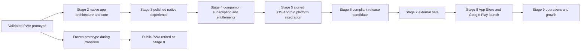
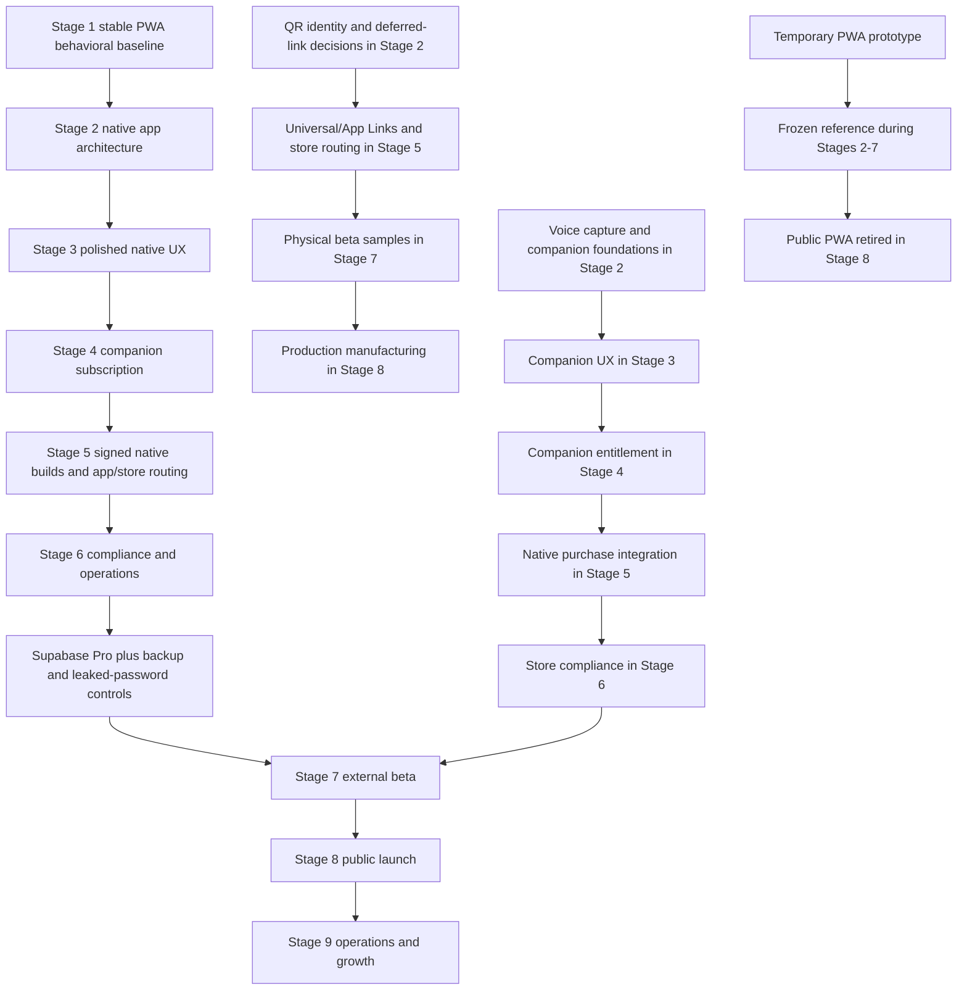

# Bookmarkt Product Roadmap

| Field | Value |
| --- | --- |
| Roadmap version | 2.0 |
| Status | Active |
| Product owner | Bookmarkt product owner |
| Current stage | Stage 3 - Polished UI/UX |
| Current gate state | Stage 2 closed with GO (D-020, August 21, 2026); iOS builds deferred to Stage 5 |
| Observation window | Stage 1 window closed early under D-013 (August 16-21, 2026) |
| Last updated | August 21, 2026 |

This document is the authoritative product roadmap for Bookmarkt. Execution and
approval rules are defined in [STAGE_GATES.md](STAGE_GATES.md), and material
roadmap decisions are recorded in [DECISION_LOG.md](DECISION_LOG.md).

Roadmap version 2.0 implements Decision D-012: Bookmarkt pivots from
AI-generated content to reader-authored capture plus a single paid AI Reading
Companion that works exclusively on the reader's own entries.

## 1. Problem statement

**Fragmented attention - trained by short-form digital media - impairs people's
ability to read books. It shows up as three failures:**

- **P1 - Stamina:** readers cannot sustain long-form reading sessions without
  drifting.
- **P2 - Recall:** returning to a book after days or weeks, the thread is lost -
  who people are, what happened - so re-entry feels like work and the book gets
  abandoned.
- **P3 - Comprehension:** even while reading, readers struggle to track
  characters, plot threads, and causality deeply enough to stay engaged.

**The consequence:** books stall and reading declines - and with it, the
sustained thinking that reading uniquely exercises.

### Honest coverage assessment

The product attacks P2 directly and centrally; every companion feature exists to
make re-entry cheap. It attacks P3 through active production: writing your own
summary and building your own character map are well-supported comprehension
interventions, reinforced by Socratic dialogue and continuity flags. P1 is
addressed only indirectly: the bet is that lower re-entry cost and deeper
engagement produce more frequent sessions, and stamina rebuilds through reading
itself. No feature directly extends session length. If P1 ever deserves direct
treatment, lightweight session mechanics (streaks, gentle session goals) fit the
mission without drift - but they are additive, not required for launch, and must
not dilute the recall/comprehension core.

## 2. Mission and product goal

**For individuals whose fragmented attention impedes their ability to read for
long periods or to recall and understand what they're reading, Bookmarkt makes
it easy to pick a book back up, stay oriented in it, and finish it.**

Bookmarkt helps people read - it never reads for them. The success metric is
**books finished**.

The launch product is a native iOS and Android application that modernizes the
physical bookmark by using its QR code to open Bookmarkt when installed or route
the reader to the correct app store when Bookmarkt is not installed.

The complete reading experience belongs in the native application. The current
PWA exists to validate the concept quickly and provide a behavioral reference
during development; it is not a launch channel. A Bookmarkt-controlled HTTPS
smart-link service remains necessary for universal/App Links, platform-specific
store routing, deferred QR context when applicable, privacy, support, and account
obligations. It does not provide the Bookmarkt reading application.

Information belongs to the reader's account, not to one phone or physical
bookmark.

## 3. Product promise

A reader can:

1. Scan a Bookmarkt QR code.
2. Open Bookmarkt directly when it is installed.
3. Reach the Apple App Store or Google Play when it is not installed.
4. Install the app and recover any supported deferred QR context.
5. Create an account or sign in securely.
6. Add and organize books they are reading.
7. Record progress and entries in their own words - typed or spoken - where one
   sentence is always enough and the entry is never judged.
8. Manually build and maintain book-specific character maps.
9. Rely on their latest entry as the spoiler-safe boundary for everything the
   product shows or asks.
10. Store book metadata and personal images.
11. Optionally subscribe to the **AI Reading Companion**: "Previously on..."
    recaps, Socratic dialogue, cue cards, character-map quizzes, semantic
    search, cross-book threads, book-club prep, continuity flags, and a
    vocabulary bank - all grounded exclusively in their own entries.
12. Return from another supported phone and recover the same account data.
13. Understand and control their subscription, privacy, data, and account.

## 4. Product principles

- **The reader authors everything.** Summaries, notes, and character maps are
  written by the reader - typed or by voice. No product surface writes the
  reading record for them.
- **The companion works only on the reader's input.** It never writes the
  record, never presents model memory of the book as unlabeled fact, and asks
  more than it answers. Hallucinated recall is structurally excluded because the
  reader's entries are the only content source.
- **Boundary from the latest entry.** The reader's most recent entry marks the
  upper boundary; no companion feature quotes, asks about, or reveals anything
  beyond it.
- **Provenance or silence.** Companion statements are labeled as coming from the
  reader's notes or, only on explicit request, from model knowledge. On weak
  recognition it declines rather than guesses, and it never grades a reader's
  answer using unverifiable knowledge.
- **Capture is free forever.** The paid subscription covers the companion,
  never the reader's own records.
- **Paid AI is server-authorized.** The backend checks the active companion
  subscription before any AI provider call. A client-side paywall is never the
  security boundary.
- **App-first launch product.** All reading workflows ship in the native iOS and
  Android applications.
- **Prototype, not permanent PWA.** The PWA remains a temporary validation and
  behavior-reference environment until the native product replaces it.
- **One shared native product core.** iOS and Android share domain behavior and
  backend services instead of becoming separate products.
- **Install-aware QR routing.** A durable smart link opens the installed app or
  sends an uninstalled mobile user to the correct platform store.
- **Account-centered continuity.** Reading data follows the authenticated user.
- **Privacy by default.** Cross-account access is prohibited and verified, not
  merely assumed. Reader entries are private records, not a model-training
  corpus.
- **Voice respects the reader's words.** The raw transcript is preserved;
  cleanup touches punctuation, never meaning.
- **Human-reviewed AI feedback.** User reports inform evaluation and product
  improvements; they do not automatically overwrite data or retrain a model.
- **Accessible and resilient.** Core reading workflows work on mobile devices,
  degraded networks, and assistive technologies.
- **Stage-gated delivery.** A later stage cannot silently redefine or bypass an
  earlier gate.
- **Reversible releases.** Schema, configuration, and application changes require
  deployment and rollback plans.
- **Permanent QR destinations.** Printed codes resolve through a
  Bookmarkt-controlled HTTPS smart-link service, never a disposable deployment
  URL or direct store URL that cannot evolve.

## 5. Initial v1 product boundaries

Bookmarkt v1 is a reading-capture product with an optional AI companion. It is
not initially:

- An ebook reader or book-content marketplace.
- A public social network.
- A source of licensed full-book text.
- An AI content generator. No product surface produces AI-written summaries,
  character maps, or images. The image-generation backend remains dormant
  behind a server-side disabled flag; re-enabling it requires a material
  roadmap decision.
- A note-quality grader. The companion never scores, corrects, or coaches the
  reader's writing style; grading capture kills the habit.
- An autonomous AI correction or model-training platform.
- A public web or PWA reading application.

The minimal website and smart-link service may display installation guidance on
unsupported/desktop devices, but they do not expose the reading product.

Changes to these boundaries require the roadmap change process.

## 6. Core user journey

```mermaid
flowchart TB
    subgraph QR["1. Open or install Bookmarkt"]
        A[Scan physical bookmark QR] --> B[Bookmarkt smart link]
        B --> C{Native app installed?}
        C -->|Yes| D[Open app through<br/>Universal/App Link]
        C -->|No| E{Mobile platform}
        E -->|iOS| F[Open Apple App Store]
        E -->|Android| G[Open Google Play]
        E -->|Unsupported/desktop| H[Show installation<br/>information]
        F --> I[Install and open Bookmarkt]
        G --> I
        I --> J[Restore deferred QR context<br/>if supported]
    end

    subgraph ACCOUNT["2. Access the account and book"]
        K{Authenticated?}
        K -->|No| L[Create account or sign in]
        K -->|Yes| BM{Scanned bookmark<br/>linked to a book? D-015}
        L --> BM
        BM -->|Yes| N2[Open the linked book<br/>directly]
        BM -->|No| M[Open library]
        M --> N[Select or add book<br/>optionally claim/link bookmark]
    end

    D --> K
    J --> K

    subgraph CAPTURE["3. Capture the session in the reader's own words"]
        O{Entry method}
        O -->|Typed| P[Write summary, notes, or<br/>character-map updates]
        O -->|Voice| Q[Record a voice note]
        Q --> R[Transcribe with<br/>punctuation-only cleanup]
        R --> RC[Reader reviews and<br/>confirms the transcript]
        P --> S[Save the entry]
        RC --> S
        S --> T[Reading boundary moves<br/>to the latest entry]
        T --> U[Optional metadata and<br/>personal image updates]
    end

    N --> O
    N2 --> O

    subgraph SYNC["4. Save and sync"]
        V[Store entries, maps, and images in<br/>user-owned rows and private Storage]
        V --> W[Sync securely to the account]
    end

    U --> V

    subgraph COMPANION["5. AI Reading Companion - optional paid layer"]
        X{Companion entitlement active?}
        X -->|No| Y[Show subscription offer<br/>capture remains free]
        Y --> Z{Store purchase verified?}
        Z -->|No/cancel/abandon| AA[Return to capture<br/>nothing is lost]
        Z -->|Yes| AB[Server-confirmed<br/>companion entitlement]
        X -->|Yes| AB
        AB --> AC[Companion grounded only in<br/>this reader's saved entries]
        AC --> AD[Recaps, Socratic dialogue,<br/>cue cards, quizzes, search]
    end

    W --> X
    AD --> AE[Return to reading]
```

### Free and paid feature matrix

| Capability | Free capture tier | AI Reading Companion (paid) |
| --- | --- | --- |
| Manual summaries and notes - typed or voice | Included | Included |
| Manual character maps | Included | Included |
| Progress and boundary tracking (latest entry = ceiling) | Included | Included |
| Book metadata and personal images | Included | Included |
| "Previously on..." recaps from the reader's entries | - | Included |
| Socratic dialogue - questions-first, ungraded by default | - | Included |
| Cue cards with deterministic spaced repetition | - | Included |
| Character-map quizzes - the reader's map is the answer key | - | Included |
| Semantic search across every logged book | - | Included |
| Cross-book threads | - | Included |
| Book-club prep - boundary-bounded | - | Included |
| Continuity flags between the reader's own entries | - | Included |
| Vocabulary bank feeding cue cards | - | Included |

*"Your notes are free forever. The companion that helps you think about them is
the subscription."*

There is exactly one paid subscription. Stage 4 sets its price, billing period,
usage quotas, and the trial that begins only after a few entries exist.
Subscribing does not itself grant access: the store purchase and server
entitlement must be verified first, and a declined, canceled, or abandoned
purchase returns the reader to capture without losing work.

## 7. Platform evolution

Stage 2 begins the native application rebuild. The PWA remains temporarily
available as a frozen prototype/reference while the native product reaches
parity. Stage 5 completes platform integration and signed distribution. Stage 8
retires the public PWA reading experience when the native apps launch.

## 8. Roadmap status

| Phase | Name | Status | Initial planning duration | Exit outcome |
| --- | --- | --- | --- | --- |
| Foundation | Functional prototype | Complete | Completed before formal tracking | QR-accessible production PWA proved the product concept |
| Stage 1 | Stabilization | Complete (GO 2026-08-21, D-013 early exit) | Minimum 1-week clean observation | Reliable and secure baseline with five clean days observed |
| Stage 2 | Architecture rebuild | In progress | 12-16 weeks | Maintainable, tested native application core |
| Stage 3 | Polished UI/UX | Planned | 8-12 weeks | Accessible, branded, validated native experience |
| Stage 4 | Monetization and accounts | Planned | 10-14 weeks | Store-compliant companion subscription and entitlement system |
| Stage 5 | Native iOS/Android packaging | Planned | 6-8 weeks | Signed internal builds on real devices |
| Stage 6 | Compliance and launch operations | Planned | 6-10 weeks | Legally and operationally ready external-beta candidate |
| Stage 7 | External beta | Planned | 6-8 weeks, including at least 14 observed days | Evidence that real users and operations are launch-ready |
| Stage 8 | App-store launch | Planned | 4-6 weeks | Public iOS/Android release and retirement of the PWA product |
| Stage 9 | Operations and growth | Planned | Ongoing after launch | Sustainable ongoing product reliability and growth |

These are gate-relative planning ranges, not fixed release commitments. Each
duration begins only after the stage entry gate passes and ends when its exit gate
is approved. The initial Stage 2-through-Stage 8 path therefore represents
approximately 52-74 weeks after Stage 2 entry. Scope changes, unresolved defects,
gate conditions, staffing, external legal or store review, and third-party
dependencies can change the ranges. Reforecast the remaining stages at every gate
review and record any material schedule change in the roadmap.

## 9. Foundation history - completed

This work predates formal gate tracking but forms the Stage 1 baseline.

- [x] Built a functional HTML/CSS/JavaScript PWA.
- [x] Connected Supabase Auth, Postgres, Storage, and Row Level Security.
- [x] Added account creation, login, logout, and persisted sessions.
- [x] Added books, metadata, reading progress, notes, and images.
- [x] Added AI summaries with configurable detail.
- [x] Added book-specific character maps with configurable detail.
- [x] Added spoiler boundaries, AI feedback, spoiler reports, analytics, and
      generation audit records.
- [x] Added Open Library metadata lookup and fallback handling.
- [x] Deployed the production PWA through Netlify.
- [x] Confirmed installation and basic use on a phone.

The AI Summary and AI Character Map generation capabilities above were part of
the validated prototype. Prototype evidence from that work - and the quality
failures it surfaced - directly motivated Decision D-012, which retires
AI-generated content from the launch product. The evidence remains valid for the
backend controls it exercised.

## 10. Stage 1 - Stabilization

**Status:** Complete — GO recorded August 21, 2026 (D-013 early exit; see
[gates/STAGE_1_REVIEW.md](gates/STAGE_1_REVIEW.md))

**Purpose:** Prove that the current production baseline is reliable, private,
secure against obvious abuse, and safe to use as the behavioral reference for
the native application rebuild. Stage 1 validates behavior and backend controls;
it does not approve the PWA as a launch channel.

### Product-scope note under D-012

Decision D-012 retires the prototype's AI-generation features from the launch
product. Stage 1 observation continues unchanged against the retained scope:
authentication, storage isolation, account sync, manual entry, image handling,
and backend cost controls. The prototype's deployed AI endpoints remain under
their Stage 1 safeguards until removed by a code change; their evidence counts
toward backend-control reliability, not toward any launch AI feature.

### Completed work

- [x] Promoted the working PWA to the production branch and URL.
- [x] Fixed stale authentication/session handling behind save timeouts.
- [x] Removed the Auth callback deadlock caused by awaiting database work while
      the Supabase Auth lock was held.
- [x] Prevented stale book requests from overwriting the newly selected book's
      entries, characters, or images.
- [x] Applied and reconciled all production database migrations.
- [x] Verified RLS on user data, analytics, AI audit data, reports, and Storage.
- [x] Made the image bucket private and changed the application to signed URLs.
- [x] Verified a second account cannot see the first account's data.
- [x] Enforced a 12-character password with uppercase, lowercase, number, and
      symbol requirements.
- [x] Required authenticated AI requests.
- [x] Added atomic limits of 30 AI generations per user per UTC day and 500
      generations across the project per UTC day.
- [x] Added AI outcome, error, usage, and latency logging.
- [x] Documented monitoring and recovery operations.
- [x] Passed phone tests for logout/login, data recovery, adding and editing a
      book, rapid book switching, AI generation, image display/upload/edit/delete,
      and weak-password rejection.

### Remaining work

- [x] Complete the stability window without a P0 or P1 defect (five clean days
      observed; final two days waived under Decision D-013).
- [x] Record the formal Stage 1 exit decision (GO, August 21, 2026).

The stability window began August 16, 2026 at 10:55 MDT (16:55 UTC). Stage 1
exited early with a GO on August 21, 2026 under Decision D-013 after five
consecutive clean days of daily product-owner use. See
[gates/STAGE_1_REVIEW.md](gates/STAGE_1_REVIEW.md).

### Deferred, non-blocking controls

The following controls are intentionally moved to the Stage 7 entry gate. They
do not block Stages 2-6:

- Supabase Pro daily database backups with seven-day retention.
- Supabase Pro leaked-password protection.

Upgrade earlier if real-user data becomes irreplaceable, external users are
invited, or Free-plan capacity/pausing becomes material.

### Stage 1 exit gate

- All production-phone acceptance flows pass.
- Database and Storage isolation are verified.
- AI-endpoint authentication, cost limits, and operational logging are active.
- The PWA is accepted only as a temporary prototype and behavioral reference.
- No unresolved P0 or P1 defect exists.
- The full seven-day stability window is complete.
- The product owner records an explicit `GO` decision.

## 11. Stage 2 - Architecture rebuild

**Status:** Complete — GO recorded August 21, 2026 (D-020; evidence in
[STAGE_2_EXIT_REVIEW.md](STAGE_2_EXIT_REVIEW.md); entered via
[gates/STAGE_2_ENTRY.md](gates/STAGE_2_ENTRY.md); iOS builds deferred to
Stage 5)

**Purpose:** Build the maintainable, typed, tested native application foundation
for iOS and Android while preserving validated prototype behavior and the shared
Supabase backend.

### Entry gate

- Stage 1 has a recorded `GO` decision.
- Current production behavior for the retained scope is captured as acceptance
  criteria.
- A rollback path to the validated Stage 1 production build exists.

### Work plan

#### Product and architecture decisions

- [x] Decide whether QR codes are generic product launchers or uniquely identify
      a physical bookmark. Decision D-015: unique per-bookmark IDs, one editable
      book link per bookmark, scan opens the linked book; account-linking,
      relink, and manufacturing implications recorded in the decision log.
- [x] Confirm the native target architecture. Decision D-014: React Native with
      Expo, TypeScript strict mode, and the shared Supabase backend, chosen over
      Flutter and Capacitor.
- [x] Select the universal/App Link, platform store-routing, and deferred
      deep-link approach (STAGE_2_ARCHITECTURE.md §1, D-017). The QR destination
      remains under Bookmarkt control.
- [x] Define domain boundaries for authentication, library, progress, entries,
      voice capture, companion, characters, images, bookmarks (D-015 claim/link
      registry), reporting, analytics, and subscriptions
      (STAGE_2_ARCHITECTURE.md §2).
- [x] Define the server-authoritative companion entitlement boundary; the native
      client can request but cannot grant access, and free capture never touches
      it (STAGE_2_ARCHITECTURE.md §3).
- [x] Define the companion session contract: one user, one book (or the user's
      library for cross-book features), the boundary from the latest entry,
      retrieval restricted to that user's entries, provenance labeling, decline
      behavior on weak recognition, and an audit record
      (STAGE_2_ARCHITECTURE.md §4).
- [x] Decide the voice transcription approach (on-device versus provider), raw
      audio retention, and transcript storage. Decision D-016: on-device
      platform recognizers, transient on-device audio deleted after transcript
      confirmation, raw transcript stored verbatim beside cleaned text.
- [x] Remove AI-generation user flows from the native product scope. Keep the
      image-generation backend dormant behind a server-side disabled flag whose
      state is covered by a configuration test. (Scope removed by D-012; no
      generation call site exists in `app/src`; `aiGenerationFlag.test.ts`
      proves the disabled default and CI live-probes the 410 on `main`.)
- [x] Define environment, secret, configuration, and deployment ownership
      (STAGE_2_ARCHITECTURE.md §5).
- [x] Record architecture decisions in the decision log or dedicated ADRs
      (D-013 through D-017; STAGE_2_ARCHITECTURE.md).

#### Application foundation

- [x] Create the approved native iOS/Android application workspace with strict
      type-checking. (Expo SDK 57 workspace under `app/`, TypeScript strict.)
- [x] Establish native navigation, authenticated screens, reusable components,
      services, state/query management, types, utilities, and themes.
      (expo-router groups, sign-in/sign-up/library/book screens, React Query,
      domain services, shared theme.)
- [x] Generate and use Supabase database types. (`app/src/lib/database.types.ts`
      generated from the live schema.)
- [x] Isolate Supabase behind typed service/repository modules. (Auth, library,
      entries, and characters domains; screens never touch Supabase directly.
      Remaining domains land with feature migration.)
- [x] Add validated environment and build-profile configuration for local,
      preview/internal, and production applications. (`app/src/lib/env.ts`
      validates at import; `app/eas.json` defines the three profiles/channels.)
- [x] Add protected native navigation and deterministic session restoration.
      (Route groups gate on the restored session; session persists via
      encrypted storage.)
- [x] Use platform-appropriate secure storage for native session material.
      (AES-encrypted AsyncStorage payload with the key in Keychain/Keystore.)
- [x] Preserve the rule that database work is deferred outside Auth callbacks.
      (Auth provider performs synchronous state updates only; data loads react
      through React Query.)
- [x] Make selected-book state and request cancellation/versioning explicit so
      stale responses cannot cross book boundaries. (Book-scoped React Query
      cache keys via `app/src/lib/queryKeys.ts`; stale responses resolve into
      the old book's key, never the visible book.)

#### Feature migration and new capture foundations

- [x] Migrate signup, login, logout, recovery, session expiry, and re-login.
      (Device-verified 2026-08-21; STAGE_2_EXIT_REVIEW.md §1.)
- [x] Migrate library, book metadata, and Open Library lookup. (Device-verified;
      manual-wins resolution unit-tested.)
- [x] Migrate reading progress and manual entries; the latest entry drives the
      boundary everywhere. (Byte-compatible headers; boundary rules unit-tested;
      device-verified.)
- [x] Migrate manual character maps and character-detail controls.
      (Device-verified; detail encoding unit-tested.)
- [x] Build voice capture: record, transcribe, punctuation-only cleanup, reader
      review and confirmation, and storage of the raw transcript alongside the
      cleaned text. (On-device recognizer via expo-speech-recognition; guarded
      require degrades Expo Go to typed entry; raw transcript stored in
      `entries.raw_transcript`; owner-verified on the Android development
      build, 2026-08-21.)
- [x] Build the companion retrieval foundation behind an entitlement-ready
      service: assemble context exclusively from the requesting user's entries,
      apply the latest-entry boundary, and attach provenance metadata.
      (`app/src/domains/companion/`; gate-first service; assembly refuses
      cross-account/cross-book/unowned rows; unit-tested.)
- [x] Migrate private image upload, signing, display, edit, and deletion.
      (Device-verified; private bucket + signed URLs.)
- [x] Migrate analytics, spoiler reporting, and issue reporting. (PWA-parity
      events; issue-report UI; spoiler reporting is a typed service without UI
      because capture-only builds have no AI content to report against.)
- [x] Add report lifecycle fields and typed services for status, priority,
      assignment, resolution notes, and resolution timestamps. (Migration
      `20260821210000`; typed statuses in the reporting service.)
- [x] Preserve legacy image-path compatibility until every row is migrated.
      (Signed-URL attachment extracts storage paths from legacy full-URL rows.)

#### Reliability and operations

- [x] Standardize loading, empty, success, timeout, offline, and error states.
      (`app/src/components/states.tsx` + query defaults; used on every screen.)
- [x] Replace developer-facing alerts with a shared notification system.
      (`app/src/components/toast.tsx`; destructive confirms remain native
      dialogs by design.)
- [x] Define native installation, app-version compatibility, over-the-air update
      boundaries, store update, offline, and stale-client behavior.
      (STAGE_2_OPERATIONS.md §2, accepted as D-018.)
- [x] Freeze the PWA to critical stabilization fixes and document its transition,
      access restriction, service-worker cleanup, and final retirement plan.
      (STAGE_2_OPERATIONS.md §7; runbook approved under D-019.)
- [x] Design and automate export/backup of actual Storage image objects; database
      backups only preserve Storage metadata. (`scripts/backup-storage.mjs` +
      cadence in STAGE_2_OPERATIONS.md §4.)
- [x] Add migration, deployment, feature-flag, rollback, and data-reconciliation
      procedures. (STAGE_2_OPERATIONS.md §3; migration checks enforced in CI.)

#### Quality system

- [x] Add unit tests for domain rules and validation. (48 jest tests across 7
      suites: progress, encoding, policy, metadata, grounding, entitlement,
      configuration.)
- [x] Add transcription tests proving the raw transcript is preserved and
      cleanup is limited to punctuation and casing. (`cleanup.test.ts` —
      verbatim word-sequence invariant across cleanup.)
- [x] Add grounding tests proving companion context contains only the requesting
      user's entries, respects the latest-entry boundary, and carries provenance
      metadata. (`grounding.test.ts`.)
- [x] Add service tests proving denied companion requests do not reach any AI
      provider and companion retrieval cannot cross account boundaries.
      (`entitlement.test.ts` + grounding refusal tests at the domain layer; the
      gate is the service's first statement and no AI provider dependency
      exists in the codebase. Live-project integration re-run lands with the
      safe test project.)
- [x] Add a configuration test proving the image-generation backend flag is
      disabled. (`aiGenerationFlag.test.ts` + live 410 probe in CI.)
- [x] Add type-check, test, build, and migration checks to pull-request CI.
      (`.github/workflows/app-ci.yml`: tsc, eslint, jest, Android export,
      migration filename/order checks, 410 probe on main.)
- [x] Add internal native preview builds and a release checklist; retain Netlify
      only for the temporary prototype and minimal web endpoints. (Release
      checklist done — STAGE_2_OPERATIONS.md §6 — and internal-distribution
      dev build d0af7ec8 owner-verified; the first preview-profile build
      transferred to Stage 3, see "Transferred at the exit gate" below.)
- [x] Define native cold-start, QR-to-app, screen-load, and interaction budgets.
      (STAGE_2_OPERATIONS.md §5.)

#### Cutover

- [x] Run old and new implementations against the same acceptance checklist for
      the retained scope. (2026-08-21 cutover run recorded in
      STAGE_2_EXIT_REVIEW.md §1.)
- [x] Resolve all parity gaps and migration risks. (Zero unresolved gaps; two
      accepted deviations recorded — structural no-book state, in-memory
      drafts.)
- [x] Prove the native alpha through controlled internal builds with rollback.
      (EAS internal-distribution build d0af7ec8 installed and owner-verified
      2026-08-21; prior builds stay installable from the EAS dashboard and the
      frozen PWA remains the validated Stage 1 fallback.)
- [x] Keep the legacy PWA available only as the temporary validated prototype
      until native beta/launch readiness; do not expand it into the final product.
      (Freeze policy in force — STAGE_2_OPERATIONS.md §7.)
- [x] Approve a retirement runbook covering routing, service-worker cleanup,
      cached installations, user communication, and backend/data continuity.
      (Approved — D-019, 2026-08-21; hardened runbook in
      STAGE_2_OPERATIONS.md §7.)

#### Transferred at the exit gate (D-020)

These work-plan items closed Stage 2 unfinished and were moved into the
receiving stage's work plan; none were waived
([gates/STAGE_2_EXIT.md](gates/STAGE_2_EXIT.md), "Deferred work"):

- Smart-link/store-routing service and its platform-detection/store-routing
  tests → **Stage 5** (build before the PWA retirement switch; D-015/D-017).
- iOS internal builds → **Stage 5** (needs the Apple developer account).
- Structured client error/performance telemetry → **Stage 5** crash and
  performance monitoring (pull into Stage 3 early if the manual budgets in
  STAGE_2_OPERATIONS.md §5 are breached).
- Native component/integration tests and Android device automation →
  **Stage 3** (iOS automation follows in Stage 5).
- Supabase service-boundary integration tests, explicit cross-account
  isolation tests, and the safe test project → **Stage 3**.
- First EAS preview build (needs eas.json env vars) → **Stage 3**.

### Stage 2 exit gate

Closed with `GO` on August 21, 2026 (D-020). The iOS criterion is deferred to
Stage 5; every other unfinished work-plan item was transferred into the
Stage 3 or Stage 5 work plan ("Transferred at the exit gate" above;
STAGE_2_EXIT_REVIEW.md §2, STAGE_2_OPERATIONS.md §8).

- The native application alpha runs on both iOS and Android development/internal
  builds. (Android met; iOS deferred to Stage 5 under D-020.)
- Every retained Stage 1 user journey has native feature parity: authentication,
  library, metadata, progress, entries, character maps, images, and reporting.
- Voice capture works end-to-end on internal device builds, including transcript
  review and raw-transcript preservation.
- The companion retrieval foundation passes grounding, boundary, cross-account,
  and denied-request tests behind an entitlement-ready flag.
- No AI-generation user flow exists in the native product; the image-generation
  backend flag is verified disabled.
- The temporary PWA scope is frozen and its retirement runbook is approved.
- Type-check, automated tests, and native builds pass in CI.
- Auth restoration, cross-account isolation, private images, and book switching
  pass automated and iOS/Android device tests.
- Schema and configuration changes are reproducible from version control.
- Native distribution/rollback, version compatibility, smart-link routing, and
  Storage-object recovery procedures are documented and exercised safely.
- No unresolved P0 or P1 defect exists.
- The product owner records a `GO` decision.

## 12. Stage 3 - Polished UI/UX

**Status:** Active (entered August 21, 2026 per Stage 2 `GO`, D-020)

**Purpose:** Turn the reliable native application into an intuitive, distinctive,
accessible iOS and Android reading product built around fast, judgment-free
capture.

### Entry gate

- Stage 2 is approved and the native shared-component architecture is stable.
- Product analytics can measure critical journeys without collecting unnecessary
  personal content.

### Work plan

- [ ] Run a continuous owner dogfooding period: use the Android dev build as
      the daily real reading companion throughout Stage 3, log every friction
      point and defect as it happens, and triage the log weekly (P0/P1 fixed
      immediately per STAGE_GATES.md). Runs alongside design work; blocks
      nothing.
- [ ] Define target readers - individuals whose fragmented attention impedes
      long-form reading, recall, or comprehension - and their priority
      jobs-to-be-done: pick the book back up, stay oriented, finish it.
- [ ] Map signup, onboarding, QR entry, library, book progress, capture (typed
      and voice), character maps, companion, settings, subscription, and support
      journeys.
- [ ] Design capture as the fastest path in the product: one-sentence entries
      are visibly acceptable, voice is one tap away, and no surface judges or
      grades the reader's writing.
- [ ] Design the voice flow: record, live or post-hoc transcript, punctuation-only
      cleanup, reader confirmation, and clear preservation of the reader's words.
- [ ] Design the companion experience: questions-first dialogue, ungraded by
      default, provenance labels ("from your notes" versus "from my knowledge"),
      explicit verified-answer requests, visible declines, and the notes-mirror
      stance when an answer conflicts with the reader's own entries.
- [ ] Design "Previously on..." recaps, cue-card review, character-map quizzes,
      semantic search, cross-book threads, book-club prep, continuity flags, and
      the vocabulary bank as boundary-safe surfaces built from the reader's
      entries.
- [ ] Design locked-companion, subscription-offer, trial, entitlement-loading,
      and expired/downgraded states without ever blocking capture.
- [ ] Show the companion offer only after a few entries exist, matching the
      trial rule; a canceled or dismissed purchase returns to capture.
- [ ] Establish Bookmarkt brand direction, typography, color, iconography,
      spacing, motion, and voice.
      - Direction locked during Stage 2 device testing (2026-08-21, user-approved):
        warm "paper and leather" palette, serif literary typography, and a
        bookshelf-metaphor library (upright covers on wooden shelves). Stage 3
        refines this direction - custom fonts, motion, cover art, accessibility
        contrast passes - rather than restarting exploration.
- [ ] Create a reusable design system with documented component states.
- [ ] Design native phone navigation and define whether tablets are supported in
      v1; desktop is not a reading-product target.
- [ ] Build the app-store-to-first-run onboarding experience and the minimal
      unsupported-device installation page.
- [ ] Add clear empty states and progressive guidance for a first book and first
      entry.
- [ ] Polish progress entry, metadata, images, and character-map interactions.
- [ ] Make the reading boundary and provenance labels unmistakable in every
      companion surface.
- [ ] Add useful confirmation and status messaging for spoiler/issue reports.
- [ ] Design offline, poor-network, expired-session, update-available, and
      recoverable-error states, including interrupted voice recordings.
- [ ] Meet WCAG 2.2 AA where applicable plus Apple and Android accessibility
      guidance for screen readers, contrast, focus, text scaling, input, and
      reduced-motion behavior; voice capture must have an equivalent typed path.
- [ ] Test touch targets and complex character-map interactions on small screens.
- [ ] Conduct moderated usability tests with representative readers, including
      readers who self-describe fragmented attention.
- [ ] Resolve all high-severity usability findings and verify analytics funnels.
- [ ] Prototype the physical bookmark, QR placement, scan distance, contrast, and
      instructions without committing to mass production.

Carried from Stage 2 (D-020):

- [ ] Add native component and integration tests for authentication, book CRUD,
      book switching, typed and voice entries, character maps, and private
      images.
- [ ] Add Android device automation for critical journeys against the internal
      dev build (iOS automation joins in Stage 5 with the Apple account).
- [ ] Provision a safe Supabase test project; add integration tests for the
      Supabase service boundaries and explicit cross-account isolation tests.
- [ ] Configure eas.json preview environment variables and ship the first
      internal preview build (also the distribution vehicle for usability
      testing).

### Stage 3 exit gate

- The design system is consistently implemented.
- Core journeys meet WCAG 2.2 AA acceptance checks.
- Representative users can complete scan-to-install/open-to-first-entry and
  return-to-book tasks without facilitator intervention.
- A returning reader can go from opening the app to reading a recap or saving a
  new entry in seconds, validated in usability tests.
- Voice and typed capture are equally viable paths to a saved entry.
- Companion surfaces show boundary and provenance clearly in usability tests.
- Supported iOS and Android phone/device layouts pass the device matrix.
- No unresolved critical usability or accessibility defect exists.
- Physical bookmark samples scan reliably under defined test conditions.
- The product owner approves the v1 experience and brand direction.

## 13. Stage 4 - Monetization and accounts

**Status:** Planned

**Purpose:** Add a policy-compliant subscription and entitlement system for the
single AI Reading Companion tier that can support the cost of AI, storage,
operations, and app-store distribution.

### Entry gate

- Stage 3 has a recorded `GO` decision.
- Stage 3 user journeys and subscription surfaces are designed.
- Pricing assumptions and companion unit costs are available.

### Work plan

- [ ] Implement the single paid subscription: **AI Reading Companion**. Free
      capture is never paywalled and never degraded by subscription state.
- [ ] Set the companion price, billing period, and introductory offer. The trial
      is server-authorized, time-bound, limited to one per account, and begins
      only after the qualifying number of entries exists.
- [ ] Build a financial model for AI cost per companion session, infrastructure,
      app-store commission, taxes, refunds, support, and target margin.
- [ ] Decide the native billing architecture before implementation. Evaluate
      StoreKit and Google Play Billing with a shared entitlement provider such as
      RevenueCat. Do not add web purchase flows without a separate approved
      product and store-policy decision.
- [ ] Verify current Apple and Google rules for digital subscriptions; do not
      route native users around required in-app purchase mechanisms.
- [ ] Create a server-authoritative entitlement model in Supabase.
- [ ] Implement idempotent signed webhooks and transaction reconciliation.
- [ ] Map the companion entitlement to server-checked feature access plus usage
      quotas (for example dialogue turns and recap/quiz generations per day) as
      cost controls.
- [ ] Require the Edge Function/backend to validate the authenticated user, the
      active companion entitlement, and the applicable usage quota before
      calling any AI provider.
- [ ] Return a clear subscription-offer response without consuming quota or
      contacting an AI provider when authorization fails.
- [ ] Audit every companion session: entitlement decision, feature, quota
      outcome, provider cost, latency, and grounding source counts, without
      logging unnecessary entry content.
- [ ] Keep all companion context assembly inside the user's security boundary;
      entries never leave user-owned RLS rows, and no reader content is used to
      train models.
- [ ] Implement purchase, restore purchase, cancellation, grace period, expiry,
      refund, and billing-retry states.
- [ ] After subscribing, require verified App Store/Google Play purchase state
      before companion access; canceled, failed, or abandoned purchases return
      safely to capture.
- [ ] Build subscription and account-management screens.
- [ ] Prevent client-only entitlement decisions.
- [ ] Add account email/password recovery and secure sensitive-account changes.
- [ ] Implement data export and account-deletion foundations covering entries,
      character maps, images, and voice transcripts.
- [ ] Add subscription analytics without exposing payment details.
- [ ] Test sandbox purchases, duplicate events, delayed webhooks, refunds,
      revocations, offline receipts, and cross-platform account restoration.
- [ ] Document customer-support procedures for billing disputes.
- [ ] Open Apple Developer and Google Play Console accounts early enough to avoid
      approval delays in Stage 5.

### Stage 4 exit gate

- Entitlements are consistent across iOS and Android test contexts and the
  server-authoritative account state.
- A free account keeps full capture functionality and cannot invoke any AI
  provider.
- An active companion subscription can use every companion feature within its
  usage quotas.
- The trial activates server-side only after the qualifying entries exist, once
  per account.
- Denied requests consume neither provider cost nor quota.
- A user who declines, cancels, abandons, or fails purchase returns to capture
  without losing work.
- A new subscription grants companion access only after server-authoritative
  purchase verification and entitlement activation.
- Companion sessions are fully reconstructable from audit records: entitlement
  decision, quota outcome, cost, and latency.
- Billing events are verified server-side, idempotent, and reconcilable.
- Purchase restoration, cancellation, expiry, and refund cases pass.
- Usage quotas enforce cost limits safely.
- Pricing demonstrates an acceptable expected margin.
- No unresolved P0/P1 payment, entitlement, or account-lifecycle defect exists.
- The product owner approves pricing and subscription behavior.

## 14. Stage 5 - Native iOS and Android packaging

**Status:** Planned

**Purpose:** Complete platform-specific integration, signing, distribution, and
QR app-or-store routing for the native iOS and Android applications.

### Entry gate

- Stage 4 has a recorded `GO` decision.
- Stage 4 entitlements are testable.
- Apple Developer and Google Play Console accounts are active.
- Bundle identifiers, signing ownership, and supported OS versions are decided.

### Work plan

- [ ] Configure the native iOS and Android projects produced by the approved
      Stage 2 architecture.
- [ ] Configure stable bundle/application IDs, signing, capabilities, and build
      environments.
- [ ] Create production icons, splash screens, launch behavior, and platform
      metadata.
- [ ] Store sensitive native session material using platform-appropriate secure
      storage.
- [ ] Implement Bookmarkt-controlled universal links and Android App Links.
- [ ] Route an uninstalled iOS user to the Apple App Store and an uninstalled
      Android user to Google Play.
- [ ] Build the minimal smart-link/store-routing service separately from the
      reading application and test its platform detection and store routing.
      (Carried from Stage 2, D-020; designed in D-015/D-017; prerequisite for
      the PWA retirement switch below.)
- [ ] Show only installation/support information for unsupported or desktop
      devices; do not expose the reading application on the web.
- [ ] Preserve deferred QR context through installation when the approved QR
      identity model requires it.
- [ ] Decide and implement generic-versus-unique bookmark linking from Stage 2.
- [ ] Handle offline, interrupted network, background/resume, and expired-session
      behavior on both platforms, including interrupted voice recordings.
- [ ] Integrate native purchase and purchase-restoration flows.
- [ ] Add only necessary permissions and explain each permission in context; the
      microphone permission is requested only when the reader chooses voice
      capture.
- [ ] Prepare Apple privacy manifests and Android permission declarations,
      including microphone and speech-recognition usage descriptions.
- [ ] Add privacy-conscious crash and performance monitoring. (Carries the
      Stage 2 structured error/performance telemetry item, D-020; pull into
      Stage 3 early if the manual performance budgets are breached.)
- [ ] Test file/image selection, keyboards, safe areas, orientation, text scaling,
      back navigation, and assistive technologies.
- [ ] Configure reproducible signed release builds and protected signing assets.
- [ ] Distribute builds through TestFlight internal testing and Google Play
      internal testing. (Carries the Stage 2 iOS internal-build criterion,
      D-020.)
- [ ] Run the device/OS compatibility matrix on physical devices.
- [ ] Prepare and safely test the PWA retirement switch, including service-worker
      unregistering, cached installations, routing, and user communication.
- [ ] Perform a preliminary App Review and Play policy checklist.

### Stage 5 exit gate

- Signed iOS and Android builds install and launch on supported real devices.
- Installed-app QR scans open Bookmarkt on iOS and Android.
- Uninstalled-app QR scans reach the correct platform store; unsupported devices
  receive installation information rather than the reading product.
- Required deferred QR context survives installation.
- Login, account sync, capture (typed and voice), character maps, images,
  companion access, and subscription restoration pass on both platforms.
- No unnecessary permission or insecure secret is present.
- Crash/performance telemetry and release rollback controls are available.
- No unresolved P0/P1 native defect exists.
- The product owner approves both internal builds.

## 15. Stage 6 - Compliance and launch operations

**Status:** Planned

**Purpose:** Make the product legally, operationally, and administratively ready
for people outside the development team.

### Entry gate

- Stage 5 has a recorded `GO` decision.
- Stage 5 produces stable signed internal builds.
- Data flows, processors, subscriptions, companion behavior, and target regions
  are known.

### Work plan

#### Privacy, legal, and store compliance

- [ ] Create a complete data inventory and processor/subprocessor register,
      including voice recordings, transcripts, and companion session data.
- [ ] Publish a privacy policy, terms of service, subscription terms, and
      acceptable-use/content rules.
- [ ] Implement the launch age posture: 13+ with an age gate. Document the
      COPPA/GDPR-K parental-consent work required before any future under-13
      access; that expansion is a separate material decision.
- [ ] Set app-store age ratings consistent with the 13+ posture and the presence
      of AI chat.
- [ ] Review copyright, trademark, book-metadata, and user-image risks. Confirm
      the companion's user-content-only grounding avoids reproducing licensed
      book text.
- [ ] Document companion behavior, limitations, provenance labels, decline
      behavior, and user reporting in plain language.
- [ ] Define voice-data handling: raw-audio retention (per the Stage 2
      decision), transcript storage, and deletion behavior.
- [ ] Implement in-app and web account deletion that satisfies Apple and Google
      requirements.
- [ ] Complete data export, deletion, retention, and legal-hold behavior.
- [ ] Prepare Apple App Privacy answers and Google Play Data Safety disclosures.
- [ ] Confirm subscription disclosure, renewal, cancellation, and restore
      language.
- [ ] Obtain qualified legal/privacy review where required.

#### Security and recovery

- [ ] Complete a threat model for Auth, Supabase, companion AI, payments, admin
      tools, native links, QR identity, voice capture, and user uploads.
- [ ] Review RLS, Storage policies, service-role use, secrets, dependencies, and
      webhook verification.
- [ ] Complete security testing and resolve high-confidence critical/high issues.
- [ ] Finalize database and Storage-object backup, restore, and retention plans.
- [ ] Rehearse a self-managed logical database export/restore and Storage-object
      recovery against a disposable local, test, or staging environment. This
      rehearsal must not depend on the Pro managed-backup feature deferred to
      Stage 7.
- [ ] Create incident response, breach assessment, outage communication, and
      credential-rotation procedures.

#### Feedback, moderation, and support

- [ ] Build a secure role-based admin review screen for companion issue reports
      and `spoiler_reports`.
- [ ] Add report status, priority, ownership, notes, timestamps, and immutable
      administrative audit history.
- [ ] Notify the review team of actionable reports without exposing report
      contents to unauthorized channels.
- [ ] Define triage, escalation, response, retention, and resolution procedures.
- [ ] Allow an appropriate user-facing acknowledgment/status without exposing
      internal diagnostics.
- [ ] Convert validated companion failures - especially grounding violations -
      into evaluation/regression cases; never automatically retrain or overwrite
      content from an unreviewed report.
- [ ] Establish customer-support intake, ownership, templates, and response goals.

#### Release operations

- [ ] Create operational dashboards for errors, latency, companion cost,
      subscriptions, reports, auth, and core funnels.
- [ ] Define service indicators, alert thresholds, escalation, and ownership.
- [ ] Prepare status, support, privacy, deletion, and contact URLs.
- [ ] Verify minimal web endpoints contain only routing, installation, privacy,
      support, and account-obligation functions, not reading-product features.
- [ ] Complete an accessibility conformance review.
- [ ] Prepare the beta runbook, tester agreement, support coverage, and rollback.

### Stage 6 exit gate

- Legal documents and store disclosures match actual behavior, including the
  13+ age gate and voice-data handling.
- Account export and deletion pass end-to-end tests.
- No unresolved critical/high security issue exists.
- Self-managed logical database and Storage-object recovery procedures are
  documented and rehearsed against a disposable environment.
- Companion and spoiler reports have an active secure review workflow and an
  accountable owner.
- Monitoring, alerting, incident response, and customer support are staffed for
  external beta.
- The product owner accepts residual legal, security, and operational risk.

## 16. Stage 7 - External beta

**Status:** Planned

**Purpose:** Validate the complete product, business model, support operation,
and physical-QR journey with representative external users before public launch.

### Mandatory entry gate

- Stage 6 has a recorded `GO` decision.
- Supabase is upgraded to Pro.
- Leaked-password protection is enabled.
- At least one scheduled daily database backup is available.
- Storage image objects have an independent backup/export mechanism.
- The companion/spoiler report queue is monitored with an assigned reviewer.
- Signed builds are approved for TestFlight external and Google Play closed
  testing.
- The temporary PWA is not an external-beta product channel.

### Work plan

- [ ] Recruit a representative tester cohort - including readers who
      self-describe fragmented attention - and obtain appropriate consent.
- [ ] Distribute TestFlight and Google Play closed-test builds.
- [ ] Test installed-app QR opening, uninstalled-app store routing, deferred QR
      context, signup, return login, account sync, books, typed and voice
      capture, character maps, companion features, subscription gating, support,
      and deletion.
- [ ] Test physical bookmark samples across phone models, lighting, wear, and QR
      distances.
- [ ] Validate generic/unique bookmark replacement and transfer behavior if
      unique codes are used.
- [ ] Measure the capture habit: entry frequency, voice-versus-typed mix,
      time-to-save, return-to-book rate, and books finished.
- [ ] Measure companion value: trial starts after qualifying entries, trial-to-
      paid conversion, recap usage at re-entry, dialogue depth, and quiz/cue-card
      engagement.
- [ ] Verify companion grounding in the field: responses labeled "from your
      notes" trace to actual entries; verified answers appear only on request;
      weak-recognition declines happen; nothing references content beyond the
      latest entry. Treat a confirmed grounding violation as a P1 defect.
- [ ] Test voice capture in real conditions: noise, accents, interruptions, and
      transcript-review correctness.
- [ ] Monitor activation, task completion, retention, crashes, errors, latency,
      companion cost, and support load.
- [ ] Exercise report triage and incident-response procedures.
- [ ] Validate subscription purchase, restore, cancellation, expiry, refunds, and
      entitlement reconciliation in store test environments.
- [ ] Verify free, trial, subscribed, expired, and restored entitlement paths;
      confirm unauthorized requests never reach a provider and capture is never
      blocked.
- [ ] Conduct load, abuse, quota, and cost-limit tests.
- [ ] Confirm backups continue and rehearse a non-production restore.
- [ ] Prioritize and fix beta findings through stage-linked issues and PRs.
- [ ] Produce a release-candidate build and beta findings report.

### Initial Stage 7 exit thresholds

These thresholds can change only through the roadmap decision process:

- A minimum 14-day representative external-beta observation period is complete.
- Zero unresolved P0 or P1 defect.
- At least 99.5% crash-free sessions on each native platform.
- At least 95% successful completion of measured critical journeys.
- No confirmed cross-account data exposure or unresolved entitlement mismatch.
- No confirmed companion entitlement bypass.
- No unresolved companion grounding violation: content presented as the
  reader's notes that is not in their notes, unlabeled model knowledge, or any
  reference beyond the latest entry.
- Actionable companion/spoiler reports are triaged within two business days.
- Backup freshness, restore rehearsal, deletion, and support procedures pass.
- Store-policy prechecks have no known launch blocker.
- External testers complete core journeys without relying on the PWA.
- The product owner records a `GO` decision for public launch preparation.

## 17. Stage 8 - App-store and public launch

**Status:** Planned

**Purpose:** Release Bookmarkt through the Apple App Store and Google Play,
activate production app-or-store QR routing, and retire the public PWA reading
experience.

### Entry gate

- Stage 7 has a recorded `GO` decision.
- Release candidate, pricing, legal text, support coverage, and rollback are
  frozen except for launch-blocking fixes.

### Work plan

- [ ] Finalize app names, descriptions, keywords, categories, screenshots,
      previews, icons, age ratings, and localization.
- [ ] Provide App Review/Play review notes, demo access, purchase instructions,
      privacy URLs, support URLs, and account-deletion instructions.
- [ ] Switch billing, webhooks, entitlements, analytics, and alerts to reviewed
      production configuration.
- [ ] Verify production signing, versioning, release notes, and provenance.
- [ ] Validate Bookmarkt-owned QR redirects and universal/app links against the
      exact release builds.
- [ ] Verify installed scans open Bookmarkt and uninstalled scans open the correct
      platform store on every supported OS/device combination.
- [ ] Activate the PWA retirement plan: stop new PWA installation, unregister its
      service worker, handle previously cached installations, and replace public
      reading routes with app/store guidance without deleting account data.
- [ ] Keep only the minimal smart-link, installation, privacy, support, and
      account-obligation website.
- [ ] Freeze and quality-check the production physical-bookmark QR artwork.
- [ ] Define manufacturing batch, QR traceability, packaging instructions,
      replacement process, inventory, and fulfillment quality controls.
- [ ] Submit iOS and Android builds and resolve review questions without making
      undocumented product changes.
- [ ] Create launch dashboards, support schedule, incident channel, rollback,
      kill switches, and customer communications.
- [ ] Tag and archive the approved `v1.0.0` source and release evidence.
- [ ] Roll out progressively where the stores permit it.
- [ ] Monitor onboarding, errors, subscriptions, companion cost and grounding
      reports, ratings, and support during launch.

### Stage 8 exit gate

- iOS and Android applications are approved and publicly available.
- Physical QR scans open the installed app or the correct platform store.
- The public PWA reading application is retired; minimal web routing and required
  support/legal/account pages remain operational.
- Subscription and entitlement production reconciliation is healthy.
- No unresolved launch P0/P1 exists.
- Initial staged rollout is complete or intentionally paused with a documented
  decision.
- Support, incident, backup, and report-review operations are functioning.
- The product owner records launch completion.

## 18. Stage 9 - Operations and growth

**Status:** Planned

**Purpose:** Operate Bookmarkt as a durable product and improve it using
validated user, reliability, safety, and commercial evidence.

After Stage 8 launch, Stage 9 becomes the ongoing active product lifecycle.

### Recurring work

- [ ] Monitor availability, latency, crashes, auth, data integrity, subscriptions,
      companion quality/cost, support, reports, app/store routing, and QR redirect
      health.
- [ ] Track the north-star metric - books finished - alongside capture
      frequency, re-entry rate after breaks, and reader-reported recall and
      comprehension improvement.
- [ ] Triage P0/P1 alerts immediately and conduct blameless incident reviews.
- [ ] Verify backups continuously and rehearse restoration at a defined cadence.
- [ ] Patch dependencies, rotate credentials, review access, and repeat security
      testing.
- [ ] Review companion/spoiler reports, maintain grounding evaluation sets, and
      test prompt/model changes against them before release.
- [ ] Monitor companion grounding-violation reports, decline rates,
      provenance-label accuracy, usage, cost per session, and quota outcomes.
- [ ] Track activation, retention, trial conversion, churn, refunds, lifetime
      value, acquisition cost, and unit economics.
- [ ] Improve onboarding, capture speed, and subscription packaging through
      controlled experiments that never add friction to capture.
- [ ] Evaluate direct stamina (P1) support - streaks or gentle session goals -
      as an additive post-launch candidate through the roadmap decision process.
- [ ] Maintain store compliance, OS compatibility, SDK requirements, privacy
      disclosures, and release notes.
- [ ] Manage support knowledge, response quality, ratings, and user research.
- [ ] Forecast Supabase, AI, storage, egress, monitoring, and support capacity.
- [ ] Monitor printed bookmark scan quality, redirect permanence, returns,
      replacements, manufacturing defects, and fulfillment.
- [ ] Prioritize future capabilities through new approved roadmap versions.

### Recurring release gate

Every material release requires:

- A stage/release issue with acceptance criteria and risk classification.
- Passing automated and platform/device checks.
- Security, privacy, data, billing, and store-policy impact review as applicable.
- Deployment, migration, monitoring, and rollback plans.
- Updated documentation and user-facing release notes.
- Product-owner approval for high-impact changes.

Stage 9 does not have a final exit. It establishes the operating lifecycle.

## 19. Critical dependencies and sequencing

Planning and research for a later stage may occur early when it reduces lead
time, but production implementation and gate approval remain sequential unless a
documented exception is approved.

## 20. Decisions required by stage

| Deadline | Decision |
| --- | --- |
| Stage 2 kickoff | Generic versus uniquely identified physical QR bookmarks |
| Stage 2 kickoff | Final native application architecture and state strategy |
| Stage 2 kickoff | Smart-link, platform store-routing, and deferred-link approach |
| Stage 2 kickoff | Voice transcription approach (on-device versus provider) and raw-audio retention |
| Stage 3 | Brand, target reader, information architecture, accessibility target |
| Stage 4 | Companion price, billing period, trial entry threshold and length, usage quotas, billing and entitlement providers |
| Stage 5 | Supported OS versions, native capabilities, bundle IDs, and store-routing details |
| Stage 6 | Launch regions, age-gate enforcement, retention, legal terms, support SLA |
| Stage 7 entry | Supabase Pro activation and external-beta operating readiness |
| Stage 7 exit | Launch thresholds and accepted residual beta risk |
| Stage 8 | Rollout regions, manufacturing volume, staged-release percentages |

## 21. Principal risks and controls

| Risk | Planned control |
| --- | --- |
| Printed QR becomes obsolete | Product-owned permanent smart link with tested app/store routing |
| QR identity model chosen too late | Mandatory Stage 2 product/data/manufacturing decision |
| Store installation creates excessive activation drop-off | Measure scan-to-store-to-activation funnel and improve store/onboarding conversion |
| Cross-account data exposure | RLS, least privilege, automated isolation tests, security review |
| Companion output drifts beyond the reader's entries | Grounding contract, provenance labels, decline-on-weak-recognition, automated grounding tests, evaluation sets, human-reviewed reports |
| Companion or infrastructure cost overrun | Server entitlement, usage quotas, budgets, alerts, unit economics |
| Companion entitlement bypass | Server-side subscription and quota check before any provider call |
| Capture friction kills the habit | One-sentence entries, voice input, fastest-path UX, habit metrics in beta |
| Voice transcription distorts the reader's words | Mandatory review step, raw transcript preserved, punctuation-only cleanup |
| Stamina (P1) is not directly addressed | Accepted product bet recorded in the problem statement; session mechanics remain an additive post-launch candidate |
| Dormant image-generation backend re-enabled accidentally | Server-side disabled flag, configuration test, material-decision requirement |
| Minors use AI chat without required consent | 13+ age gate at launch, store age ratings, under-13 access deferred to a separate material decision |
| Database backup omits images | Independent Storage-object backup/export and restore procedure |
| App-store billing rejection | Store-policy decision before billing implementation |
| Prototype/native behavior diverges during transition | Stage 1 acceptance baseline, parity tests, and frozen PWA scope |
| Temporary PWA remains accessible after launch | Tested retirement switch, service-worker cleanup, routing, and communication |
| App-store outage, delisting, or review delay blocks acquisition | Staged submissions, policy prechecks, operational alerts, and installation guidance |
| Subscription inconsistency | Server-authoritative entitlements and webhook reconciliation |
| Legal/privacy mismatch | Data inventory, verified deletion/export, accurate store disclosures |
| Reports collected but ignored | Secure admin queue, assigned reviewer, triage SLA, audit history |
| Physical bookmark scan failures | Prototype, environmental tests, production quality controls |

## 22. Definition of v1 launch readiness

Bookmarkt v1 is launch-ready only when:

- A physical QR code opens Bookmarkt when installed or the correct Apple App
  Store/Google Play listing when uninstalled.
- Unsupported/desktop scans receive installation information, not a web reading
  application.
- New and returning users can authenticate and recover account data.
- Books, progress, reader-authored entries (typed and voice), manual character
  maps, and personal images work consistently across supported platforms.
- The reader's latest entry drives the boundary in every product surface.
- Free capture is never paywalled; only an active AI Reading Companion
  subscription reaches companion features, and denied requests never reach a
  provider.
- Companion responses are grounded in the reader's own entries with visible
  provenance labels, decline on weak recognition, and no unresolved grounding
  violation.
- No product surface generates AI summaries, character maps, or images; the
  image-generation backend is verified dormant.
- Cross-account isolation and private-image access are verified.
- Subscriptions and entitlements are accurate and restorable.
- The 13+ age gate is active, and privacy, account deletion/export, legal
  disclosures, and store declarations match actual behavior.
- Database and image recovery, incident response, support, and report review are
  operational.
- iOS and Android release candidates meet their respective store policies.
- The public PWA reading experience is retired without losing account data.
- Stage 7 evidence supports a documented launch `GO` decision.
