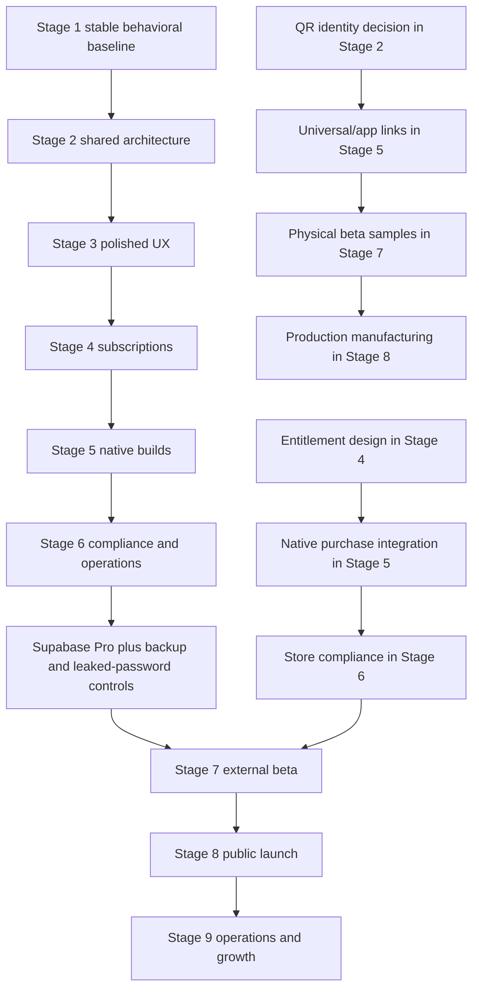

# Bookmarkt Product Roadmap

| Field | Value |
| --- | --- |
| Roadmap version | 1.0 |
| Status | Active |
| Product owner | Bookmarkt product owner |
| Current stage | Stage 1 - Stabilization |
| Current gate state | Seven-day production stability observation |
| Observation window | August 16, 2026 at 10:55 MDT through August 23, 2026 at 10:55 MDT |
| Last updated | August 16, 2026 |

This document is the authoritative product roadmap for Bookmarkt. Execution and
approval rules are defined in [STAGE_GATES.md](STAGE_GATES.md), and material
roadmap decisions are recorded in [DECISION_LOG.md](DECISION_LOG.md).

## 1. Product goal

**Build a cross-platform product that modernizes the physical bookmark by using
a QR code on the bookmark to open a secure reading companion where a reader can
record, recover, and build on everything they have read so far.**

The QR experience must work without requiring an app installation. A reader who
has installed the iOS or Android app should be taken into the app when possible,
while every other reader receives a reliable web experience. Information belongs
to the reader's account, not to one browser, phone, or physical bookmark.

## 2. Product promise

A reader can:

1. Scan a Bookmarkt QR code.
2. Create an account or sign in securely.
3. Add and organize books they are reading.
4. Record reading progress and personal notes.
5. Generate an optional AI summary constrained to what they have read.
6. Build and maintain book-specific character maps.
7. Store book metadata and personal images.
8. Return from another device and recover the same account data.
9. Use the product through the web, an installable PWA, or the future iOS and
   Android applications.
10. Understand and control their subscription, privacy, data, and account.

## 3. Product principles

- **QR first, not app only.** A printed bookmark must remain useful even when the
  native app is not installed.
- **One shared product core.** Web, PWA, iOS, and Android should share domain
  behavior instead of becoming separate products.
- **Account-centered continuity.** Reading data follows the authenticated user.
- **Privacy by default.** Cross-account access is prohibited and verified, not
  merely assumed.
- **Spoiler-aware AI.** AI output respects the reader's recorded boundary and
  offers a clear reporting path.
- **Human-reviewed AI feedback.** User reports inform evaluation and product
  improvements; they do not automatically overwrite data or retrain a model.
- **Accessible and resilient.** Core reading workflows work on mobile devices,
  degraded networks, and assistive technologies.
- **Stage-gated delivery.** A later stage cannot silently redefine or bypass an
  earlier gate.
- **Reversible releases.** Schema, configuration, and application changes require
  deployment and rollback plans.
- **Permanent QR destinations.** Printed codes should resolve through a
  Bookmarkt-controlled HTTPS domain or redirect service, never a disposable
  deployment URL.

## 4. Initial v1 product boundaries

Bookmarkt v1 is a personal reading companion. It is not initially:

- An ebook reader or book-content marketplace.
- A public social network.
- A source of licensed full-book text.
- An autonomous AI correction or model-training platform.
- Dependent on native installation for the QR journey.

Changes to these boundaries require the roadmap change process.

## 5. Core user journey

```mermaid
flowchart LR
    A[Scan physical bookmark QR] --> B{Native app installed?}
    B -->|Yes| C[Open app through universal/app link]
    B -->|No| D[Open secure web/PWA landing]
    C --> E{Authenticated?}
    D --> E
    E -->|No| F[Create account or sign in]
    E -->|Yes| G[Open library]
    F --> G
    G --> H[Select or add book]
    H --> I[Record reading boundary]
    I --> J{Entry type}
    J -->|Manual| K[Write and save notes]
    J -->|AI-assisted| L[Generate bounded summary]
    K --> M[Update character map and images]
    L --> M
    M --> N[Sync securely to account]
    N --> O[Resume on any supported device]
```

## 6. Platform evolution

Stage 2 begins the app-quality product build, but it does not remove the PWA.
Native packaging occurs in Stage 5.

```mermaid
flowchart LR
    A[Validated PWA prototype] --> B[Stage 2 shared React/TypeScript core]
    B --> C[Stage 3 polished responsive product]
    C --> D[Stage 4 entitlements and subscriptions]
    D --> E[Stage 5 Capacitor iOS/Android shells]
    E --> F[Stage 6 compliant release candidate]
    F --> G[Stage 7 external beta]
    G --> H[Stage 8 App Store and Google Play launch]
    H --> I[Stage 9 operations and growth]
```

## 7. Roadmap status

| Phase | Name | Status | Exit outcome |
| --- | --- | --- | --- |
| Foundation | Functional prototype | Complete | QR-accessible production PWA proved the product concept |
| Stage 1 | Stabilization | Observation | Reliable and secure baseline with seven clean days |
| Stage 2 | Architecture rebuild | Planned | Maintainable, tested, app-quality shared codebase |
| Stage 3 | Polished UI/UX | Planned | Accessible, branded, validated user experience |
| Stage 4 | Monetization and accounts | Planned | Store-compliant subscriptions and entitlement system |
| Stage 5 | Native iOS/Android packaging | Planned | Signed internal builds on real devices |
| Stage 6 | Compliance and launch operations | Planned | Legally and operationally ready external-beta candidate |
| Stage 7 | External beta | Planned | Evidence that real users and operations are launch-ready |
| Stage 8 | App-store launch | Planned | Controlled public iOS, Android, and web release |
| Stage 9 | Operations and growth | Planned | Sustainable ongoing product reliability and growth |

## 8. Foundation history - completed

This work predates formal gate tracking but forms the Stage 1 baseline.

- [x] Built a functional HTML/CSS/JavaScript PWA.
- [x] Connected Supabase Auth, Postgres, Storage, and Row Level Security.
- [x] Added account creation, login, logout, and persisted sessions.
- [x] Added books, metadata, reading progress, notes, and images.
- [x] Added AI summaries with configurable detail.
- [x] Added book-specific character maps with configurable detail.
- [x] Added spoiler boundaries, AI feedback, spoiler reports, analytics, and
      generation audit records.
- [x] Added Open Library metadata lookup and fallback handling.
- [x] Deployed the production PWA through Netlify.
- [x] Confirmed installation and basic use on a phone.

## 9. Stage 1 - Stabilization

**Status:** Observation

**Purpose:** Prove that the current production baseline is reliable, private,
secure against obvious abuse, and safe to use as the behavioral reference for
the architecture rebuild.

### Completed work

- [x] Promoted the working PWA to the production branch and URL.
- [x] Fixed stale authentication/session handling behind save timeouts.
- [x] Removed the Auth callback deadlock caused by awaiting database work while
      the Supabase Auth lock was held.
- [x] Prevented stale book requests from overwriting the newly selected book's
      entries, characters, or images.
- [x] Applied and reconciled all production database migrations.
- [x] Verified RLS on user data, analytics, AI audit data, reports, and Storage.
- [x] Made the image bucket private and changed the application to signed URLs.
- [x] Verified a second account cannot see the first account's data.
- [x] Enforced a 12-character password with uppercase, lowercase, number, and
      symbol requirements.
- [x] Required authenticated AI requests.
- [x] Added atomic limits of 30 AI generations per user per UTC day and 500
      generations across the project per UTC day.
- [x] Added AI outcome, error, usage, and latency logging.
- [x] Documented monitoring and recovery operations.
- [x] Passed phone tests for logout/login, data recovery, adding and editing a
      book, rapid book switching, AI generation, image display/upload/edit/delete,
      and weak-password rejection.

### Remaining work

- [ ] Complete seven consecutive days without a P0 or P1 defect.
- [ ] Record the formal Stage 1 exit decision.

The stability window began August 16, 2026 at 10:55 MDT (16:55 UTC). Seven
consecutive 24-hour periods complete on August 23, 2026 at 10:55 MDT (16:55 UTC);
that is the earliest exit review. See
[gates/STAGE_1_REVIEW.md](gates/STAGE_1_REVIEW.md).

### Deferred, non-blocking controls

The following controls are intentionally moved to the Stage 7 entry gate. They
do not block Stages 2-6:

- Supabase Pro daily database backups with seven-day retention.
- Supabase Pro leaked-password protection.

Upgrade earlier if real-user data becomes irreplaceable, external users are
invited, or Free-plan capacity/pausing becomes material.

### Stage 1 exit gate

- All production-phone acceptance flows pass.
- Database and Storage isolation are verified.
- AI authentication, cost limits, and operational logging are active.
- No unresolved P0 or P1 defect exists.
- The full seven-day stability window is complete.
- The product owner records an explicit `GO` decision.

## 10. Stage 2 - Architecture rebuild

**Status:** Planned

**Purpose:** Replace the monolithic prototype with a maintainable, typed, tested
shared application while preserving the QR-accessible web/PWA experience.

### Entry gate

- Stage 1 has a recorded `GO` decision.
- Current production behavior is captured as acceptance criteria.
- A rollback path to the validated Stage 1 production build exists.

### Work plan

#### Product and architecture decisions

- [ ] Decide whether QR codes are generic product launchers or uniquely identify
      a physical bookmark. Document account-linking, replacement, transfer, and
      manufacturing implications before changing the data model.
- [ ] Confirm the target architecture. The recommended baseline is Vite, React,
      TypeScript, Supabase, and a later Capacitor native shell.
- [ ] Define domain boundaries for authentication, library, progress, entries,
      AI, characters, images, reporting, analytics, and subscriptions.
- [ ] Define environment, secret, configuration, and deployment ownership.
- [ ] Record architecture decisions in the decision log or dedicated ADRs.

#### Application foundation

- [ ] Create the Vite/React/TypeScript application and strict type-checking.
- [ ] Establish routes, authenticated layouts, reusable components, services,
      state/query management, types, utilities, and styles.
- [ ] Generate and use Supabase database types.
- [ ] Isolate Supabase behind typed service/repository modules.
- [ ] Add validated environment configuration for local, preview, and production.
- [ ] Add protected routing and deterministic session restoration.
- [ ] Preserve the rule that database work is deferred outside Auth callbacks.
- [ ] Make selected-book state and request cancellation/versioning explicit so
      stale responses cannot cross book boundaries.

#### Feature-parity migration

- [ ] Migrate signup, login, logout, recovery, session expiry, and re-login.
- [ ] Migrate library, book metadata, and Open Library lookup.
- [ ] Migrate reading progress and manual entries.
- [ ] Migrate bounded AI summaries and AI usage messaging.
- [ ] Migrate character maps and character-detail controls.
- [ ] Migrate private image upload, signing, display, edit, and deletion.
- [ ] Migrate analytics, spoiler reporting, and AI issue reporting.
- [ ] Add report lifecycle fields and typed services for status, priority,
      assignment, resolution notes, and resolution timestamps.
- [ ] Preserve legacy image-path compatibility until every row is migrated.

#### Reliability and operations

- [ ] Standardize loading, empty, success, timeout, offline, and error states.
- [ ] Replace developer-facing alerts with a shared notification system.
- [ ] Define PWA install, service-worker update, cache invalidation, and
      stale-version recovery behavior.
- [ ] Add structured client error and performance telemetry with privacy limits.
- [ ] Design and automate export/backup of actual Storage image objects; database
      backups only preserve Storage metadata.
- [ ] Add migration, deployment, feature-flag, rollback, and data-reconciliation
      procedures.

#### Quality system

- [ ] Add unit tests for domain rules and validation.
- [ ] Add integration tests for Supabase service boundaries.
- [ ] Add browser tests for authentication, book CRUD, book switching, entries,
      AI error handling, character maps, and private images.
- [ ] Add explicit cross-account isolation tests against a safe test project.
- [ ] Add type-check, test, build, and migration checks to pull-request CI.
- [ ] Add Netlify preview deployments and a production release checklist.
- [ ] Define performance budgets for initial load and core interactions.

#### Cutover

- [ ] Run old and new implementations against the same acceptance checklist.
- [ ] Resolve all parity gaps and migration risks.
- [ ] Deploy through a controlled release with a tested rollback.
- [ ] Retire the legacy monolithic `index.html` implementation only after the new
      application proves feature parity.

### Stage 2 exit gate

- Production no longer depends on the monolithic application.
- Every Stage 1 user journey has parity on desktop, mobile web, and installed PWA.
- Type-check, automated tests, and production builds pass in CI.
- Auth restoration, cross-account isolation, private images, book switching, and
  AI generation pass automated and real-device tests.
- Schema and configuration changes are reproducible from version control.
- Deployment, rollback, cache update, and Storage-object recovery procedures are
  documented and exercised safely.
- No unresolved P0 or P1 defect exists.
- The product owner records a `GO` decision.

## 11. Stage 3 - Polished UI/UX

**Status:** Planned

**Purpose:** Turn the reliable shared application into an intuitive, distinctive,
accessible reading product.

### Entry gate

- Stage 2 is approved and the shared component architecture is stable.
- Product analytics can measure critical journeys without collecting unnecessary
  personal content.

### Work plan

- [ ] Define target readers, primary jobs-to-be-done, and priority use cases.
- [ ] Map signup, onboarding, QR entry, library, book progress, AI assistance,
      character maps, settings, subscription, and support journeys.
- [ ] Establish Bookmarkt brand direction, typography, color, iconography,
      spacing, motion, and voice.
- [ ] Create a reusable design system with documented component states.
- [ ] Design mobile-first navigation and responsive tablet/desktop layouts.
- [ ] Build a focused QR landing and first-run onboarding experience.
- [ ] Add clear empty states and progressive guidance for a first book and entry.
- [ ] Polish progress entry, AI controls, metadata, images, and character-map
      interactions.
- [ ] Make AI-generated content and reading boundaries unmistakable.
- [ ] Add useful confirmation and status messaging for AI/spoiler reports.
- [ ] Design offline, poor-network, expired-session, update-available, and
      recoverable-error states.
- [ ] Meet WCAG 2.2 AA for core journeys, including keyboard, screen-reader,
      contrast, focus, text scaling, and reduced-motion behavior.
- [ ] Test touch targets and complex character-map interactions on small screens.
- [ ] Conduct moderated usability tests with representative readers.
- [ ] Resolve all high-severity usability findings and verify analytics funnels.
- [ ] Prototype the physical bookmark, QR placement, scan distance, contrast, and
      instructions without committing to mass production.

### Stage 3 exit gate

- The design system is consistently implemented.
- Core journeys meet WCAG 2.2 AA acceptance checks.
- Representative users can complete scan-to-first-entry and return-to-book tasks
  without facilitator intervention.
- Mobile, tablet, and desktop layouts pass the supported-device matrix.
- No unresolved critical usability or accessibility defect exists.
- Physical bookmark samples scan reliably under defined test conditions.
- The product owner approves the v1 experience and brand direction.

## 12. Stage 4 - Monetization and accounts

**Status:** Planned

**Purpose:** Add a policy-compliant subscription and entitlement system that can
support the cost of AI, storage, operations, and app-store distribution.

### Entry gate

- Stage 3 has a recorded `GO` decision.
- Stage 3 user journeys and subscription surfaces are designed.
- Pricing assumptions and AI unit costs are available.

### Work plan

- [ ] Define free, trial, and paid tiers, including AI, storage, and feature
      entitlements.
- [ ] Build a financial model for AI cost, infrastructure, app-store commission,
      taxes, refunds, support, and target margin.
- [ ] Decide the billing architecture before implementation. Evaluate native
      StoreKit/Google Play Billing with a shared entitlement provider such as
      RevenueCat, plus Stripe for eligible web purchases.
- [ ] Verify current Apple and Google rules for digital subscriptions; do not
      route native users around required in-app purchase mechanisms.
- [ ] Create a server-authoritative entitlement model in Supabase.
- [ ] Implement idempotent signed webhooks and transaction reconciliation.
- [ ] Map subscription entitlements to AI and storage quotas.
- [ ] Implement plans, trials, purchase, restore purchase, upgrade, downgrade,
      cancellation, grace period, expiry, refund, and billing-retry states.
- [ ] Build subscription and account-management screens.
- [ ] Prevent client-only entitlement decisions.
- [ ] Add account email/password recovery and secure sensitive-account changes.
- [ ] Implement data export and account-deletion foundations.
- [ ] Add subscription analytics without exposing payment details.
- [ ] Test sandbox purchases, duplicate events, delayed webhooks, refunds,
      revocations, offline receipts, and cross-platform account restoration.
- [ ] Document customer-support procedures for billing disputes.
- [ ] Open Apple Developer and Google Play Console accounts early enough to avoid
      approval delays in Stage 5.

### Stage 4 exit gate

- Entitlements are consistent across web, iOS test, and Android test contexts.
- Billing events are verified server-side, idempotent, and reconcilable.
- Purchase restoration, cancellation, expiry, and refund cases pass.
- AI and storage limits enforce the selected plan safely.
- Pricing demonstrates an acceptable expected margin.
- No unresolved P0/P1 payment, entitlement, or account-lifecycle defect exists.
- The product owner approves pricing and subscription behavior.

## 13. Stage 5 - Native iOS and Android packaging

**Status:** Planned

**Purpose:** Package the shared product as reliable signed native applications
without breaking the universal QR-to-web fallback.

### Entry gate

- Stage 4 has a recorded `GO` decision.
- Stage 4 entitlements are testable.
- Apple Developer and Google Play Console accounts are active.
- Bundle identifiers, signing ownership, and supported OS versions are decided.

### Work plan

- [ ] Add Capacitor iOS and Android projects around the shared application.
- [ ] Configure stable bundle/application IDs, signing, capabilities, and build
      environments.
- [ ] Create production icons, splash screens, launch behavior, and platform
      metadata.
- [ ] Store sensitive native session material using platform-appropriate secure
      storage.
- [ ] Implement Bookmarkt-controlled universal links and Android App Links.
- [ ] Ensure each QR destination falls back safely to web when the app is absent.
- [ ] Decide and implement generic-versus-unique bookmark linking from Stage 2.
- [ ] Handle offline, interrupted network, background/resume, and expired-session
      behavior on both platforms.
- [ ] Integrate native purchase and purchase-restoration flows.
- [ ] Add only necessary permissions and explain each permission in context.
- [ ] Prepare Apple privacy manifests and Android permission declarations.
- [ ] Add privacy-conscious crash and performance monitoring.
- [ ] Test file/image selection, keyboards, safe areas, orientation, text scaling,
      back navigation, and assistive technologies.
- [ ] Configure reproducible signed release builds and protected signing assets.
- [ ] Distribute builds through TestFlight internal testing and Google Play
      internal testing.
- [ ] Run the device/OS compatibility matrix on physical devices.
- [ ] Perform a preliminary App Review and Play policy checklist.

### Stage 5 exit gate

- Signed iOS and Android builds install and launch on supported real devices.
- QR universal/app links work with installed-app and web-fallback paths.
- Login, account sync, all core reading workflows, images, AI, and subscription
  restoration pass on both platforms.
- No unnecessary permission or insecure secret is present.
- Crash/performance telemetry and release rollback controls are available.
- No unresolved P0/P1 native defect exists.
- The product owner approves both internal builds.

## 14. Stage 6 - Compliance and launch operations

**Status:** Planned

**Purpose:** Make the product legally, operationally, and administratively ready
for people outside the development team.

### Entry gate

- Stage 5 has a recorded `GO` decision.
- Stage 5 produces stable signed internal builds.
- Data flows, processors, subscriptions, AI behavior, and target regions are
  known.

### Work plan

#### Privacy, legal, and store compliance

- [ ] Create a complete data inventory and processor/subprocessor register.
- [ ] Publish a privacy policy, terms of service, subscription terms, and
      acceptable-use/content rules.
- [ ] Define age eligibility, parental-consent requirements, content rating, and
      launch regions.
- [ ] Review copyright, trademark, book-metadata, user-image, and AI-output risks.
- [ ] Document AI use, limitations, spoiler risk, and user reporting.
- [ ] Implement in-app and web account deletion that satisfies Apple and Google
      requirements.
- [ ] Complete data export, deletion, retention, and legal-hold behavior.
- [ ] Prepare Apple App Privacy answers and Google Play Data Safety disclosures.
- [ ] Confirm subscription disclosure, renewal, cancellation, and restore
      language.
- [ ] Obtain qualified legal/privacy review where required.

#### Security and recovery

- [ ] Complete a threat model for Auth, Supabase, AI, payments, admin tools,
      native links, QR identity, and user uploads.
- [ ] Review RLS, Storage policies, service-role use, secrets, dependencies, and
      webhook verification.
- [ ] Complete security testing and resolve high-confidence critical/high issues.
- [ ] Finalize database and Storage-object backup, restore, and retention plans.
- [ ] Rehearse a self-managed logical database export/restore and Storage-object
      recovery against a disposable local, test, or staging environment. This
      rehearsal must not depend on the Pro managed-backup feature deferred to
      Stage 7.
- [ ] Create incident response, breach assessment, outage communication, and
      credential-rotation procedures.

#### Feedback, moderation, and support

- [ ] Build a secure role-based admin review screen for `ai_feedback_reports` and
      `spoiler_reports`.
- [ ] Add report status, priority, ownership, notes, timestamps, and immutable
      administrative audit history.
- [ ] Notify the review team of actionable reports without exposing report
      contents to unauthorized channels.
- [ ] Define triage, escalation, response, retention, and resolution procedures.
- [ ] Allow an appropriate user-facing acknowledgment/status without exposing
      internal diagnostics.
- [ ] Convert validated AI failures into evaluation/regression cases; never
      automatically retrain or overwrite content from an unreviewed report.
- [ ] Establish customer-support intake, ownership, templates, and response goals.

#### Release operations

- [ ] Create operational dashboards for errors, latency, AI cost, subscriptions,
      reports, auth, and core funnels.
- [ ] Define service indicators, alert thresholds, escalation, and ownership.
- [ ] Prepare status, support, privacy, deletion, and contact URLs.
- [ ] Complete an accessibility conformance review.
- [ ] Prepare the beta runbook, tester agreement, support coverage, and rollback.

### Stage 6 exit gate

- Legal documents and store disclosures match actual behavior.
- Account export and deletion pass end-to-end tests.
- No unresolved critical/high security issue exists.
- Self-managed logical database and Storage-object recovery procedures are
  documented and rehearsed against a disposable environment.
- AI/spoiler reports have an active secure review workflow and accountable owner.
- Monitoring, alerting, incident response, and customer support are staffed for
  external beta.
- The product owner accepts residual legal, security, and operational risk.

## 15. Stage 7 - External beta

**Status:** Planned

**Purpose:** Validate the complete product, business model, support operation,
and physical-QR journey with representative external users before public launch.

### Mandatory entry gate

- Stage 6 has a recorded `GO` decision.
- Supabase is upgraded to Pro.
- Leaked-password protection is enabled.
- At least one scheduled daily database backup is available.
- Storage image objects have an independent backup/export mechanism.
- The AI/spoiler report queue is monitored with an assigned reviewer.
- Signed builds are approved for TestFlight external and Google Play closed
  testing.

### Work plan

- [ ] Recruit a representative tester cohort and obtain appropriate consent.
- [ ] Distribute web/PWA, TestFlight, and Google Play closed-test builds.
- [ ] Test scan-to-app, scan-to-web, signup, return login, account sync, books,
      entries, AI, maps, images, subscriptions, support, and deletion.
- [ ] Test physical bookmark samples across phone models, lighting, wear, and QR
      distances.
- [ ] Validate generic/unique bookmark replacement and transfer behavior if
      unique codes are used.
- [ ] Monitor activation, task completion, retention, crashes, errors, latency,
      AI cost, AI quality, spoiler reports, and support load.
- [ ] Exercise report triage and incident-response procedures.
- [ ] Validate subscription purchase, restore, cancellation, expiry, refunds, and
      entitlement reconciliation in store test environments.
- [ ] Conduct load, abuse, quota, and cost-limit tests.
- [ ] Confirm backups continue and rehearse a non-production restore.
- [ ] Prioritize and fix beta findings through stage-linked issues and PRs.
- [ ] Produce a release-candidate build and beta findings report.

### Initial Stage 7 exit thresholds

These thresholds can change only through the roadmap decision process:

- A minimum 14-day representative external-beta observation period is complete.
- Zero unresolved P0 or P1 defect.
- At least 99.5% crash-free sessions on each native platform.
- At least 95% successful completion of measured critical journeys.
- No confirmed cross-account data exposure or unresolved entitlement mismatch.
- Actionable AI/spoiler reports are triaged within two business days.
- Backup freshness, restore rehearsal, deletion, and support procedures pass.
- Store-policy prechecks have no known launch blocker.
- The product owner records a `GO` decision for public launch preparation.

## 16. Stage 8 - App-store and public launch

**Status:** Planned

**Purpose:** Release Bookmarkt safely through the Apple App Store, Google Play,
and the production web/PWA channel.

### Entry gate

- Stage 7 has a recorded `GO` decision.
- Release candidate, pricing, legal text, support coverage, and rollback are
  frozen except for launch-blocking fixes.

### Work plan

- [ ] Finalize app names, descriptions, keywords, categories, screenshots,
      previews, icons, age ratings, and localization.
- [ ] Provide App Review/Play review notes, demo access, purchase instructions,
      privacy URLs, support URLs, and account-deletion instructions.
- [ ] Switch billing, webhooks, entitlements, analytics, and alerts to reviewed
      production configuration.
- [ ] Verify production signing, versioning, release notes, and provenance.
- [ ] Validate Bookmarkt-owned QR redirects and universal/app links against the
      exact release builds.
- [ ] Freeze and quality-check the production physical-bookmark QR artwork.
- [ ] Define manufacturing batch, QR traceability, packaging instructions,
      replacement process, inventory, and fulfillment quality controls.
- [ ] Submit iOS and Android builds and resolve review questions without making
      undocumented product changes.
- [ ] Create launch dashboards, support schedule, incident channel, rollback,
      kill switches, and customer communications.
- [ ] Tag and archive the approved `v1.0.0` source and release evidence.
- [ ] Roll out progressively where the stores permit it.
- [ ] Monitor onboarding, errors, subscriptions, AI cost, reports, ratings, and
      support during launch.

### Stage 8 exit gate

- iOS and Android applications are approved and publicly available.
- The web/PWA fallback and physical QR journey remain operational.
- Subscription and entitlement production reconciliation is healthy.
- No unresolved launch P0/P1 exists.
- Initial staged rollout is complete or intentionally paused with a documented
  decision.
- Support, incident, backup, and report-review operations are functioning.
- The product owner records launch completion.

## 17. Stage 9 - Operations and growth

**Status:** Planned

**Purpose:** Operate Bookmarkt as a durable product and improve it using
validated user, reliability, safety, and commercial evidence.

After Stage 8 launch, Stage 9 becomes the ongoing active product lifecycle.

### Recurring work

- [ ] Monitor availability, latency, crashes, auth, data integrity, subscriptions,
      AI quality/cost, support, reports, and QR redirect health.
- [ ] Triage P0/P1 alerts immediately and conduct blameless incident reviews.
- [ ] Verify backups continuously and rehearse restoration at a defined cadence.
- [ ] Patch dependencies, rotate credentials, review access, and repeat security
      testing.
- [ ] Review AI/spoiler reports, maintain evaluation sets, and test prompt/model
      changes before release.
- [ ] Track activation, retention, conversion, churn, refunds, lifetime value,
      acquisition cost, and unit economics.
- [ ] Improve onboarding, reading value, and subscription packaging through
      controlled experiments.
- [ ] Maintain store compliance, OS compatibility, SDK requirements, privacy
      disclosures, and release notes.
- [ ] Manage support knowledge, response quality, ratings, and user research.
- [ ] Forecast Supabase, AI, storage, egress, monitoring, and support capacity.
- [ ] Monitor printed bookmark scan quality, redirect permanence, returns,
      replacements, manufacturing defects, and fulfillment.
- [ ] Prioritize future capabilities through new approved roadmap versions.

### Recurring release gate

Every material release requires:

- A stage/release issue with acceptance criteria and risk classification.
- Passing automated and platform/device checks.
- Security, privacy, data, billing, and store-policy impact review as applicable.
- Deployment, migration, monitoring, and rollback plans.
- Updated documentation and user-facing release notes.
- Product-owner approval for high-impact changes.

Stage 9 does not have a final exit. It establishes the operating lifecycle.

## 18. Critical dependencies and sequencing

Planning and research for a later stage may occur early when it reduces lead
time, but production implementation and gate approval remain sequential unless a
documented exception is approved.

## 19. Decisions required by stage

| Deadline | Decision |
| --- | --- |
| Stage 2 kickoff | Generic versus uniquely identified physical QR bookmarks |
| Stage 2 kickoff | Final shared application architecture and state strategy |
| Stage 3 | Brand, target reader, information architecture, accessibility target |
| Stage 4 | Plans, prices, trials, AI quotas, billing and entitlement providers |
| Stage 5 | Supported OS versions, native capabilities, bundle IDs, deep links |
| Stage 6 | Launch regions, age eligibility, retention, legal terms, support SLA |
| Stage 7 entry | Supabase Pro activation and external-beta operating readiness |
| Stage 7 exit | Launch thresholds and accepted residual beta risk |
| Stage 8 | Rollout regions, manufacturing volume, staged-release percentages |

## 20. Principal risks and controls

| Risk | Planned control |
| --- | --- |
| Printed QR becomes obsolete | Product-owned permanent redirect and tested web fallback |
| QR identity model chosen too late | Mandatory Stage 2 product/data/manufacturing decision |
| Cross-account data exposure | RLS, least privilege, automated isolation tests, security review |
| AI hallucination or spoilers | Reading boundaries, reports, audits, evaluation sets, human review |
| AI or infrastructure cost overrun | Authenticated quotas, entitlements, budgets, alerts, unit economics |
| Database backup omits images | Independent Storage-object backup/export and restore procedure |
| App-store billing rejection | Store-policy decision before billing implementation |
| Web/native behavior diverges | Shared core, parity tests, native shells rather than separate products |
| PWA serves stale releases | Explicit service-worker version/update strategy and rollback |
| Subscription inconsistency | Server-authoritative entitlements and webhook reconciliation |
| Legal/privacy mismatch | Data inventory, verified deletion/export, accurate store disclosures |
| Reports collected but ignored | Secure admin queue, assigned reviewer, triage SLA, audit history |
| Physical bookmark scan failures | Prototype, environmental tests, production quality controls |

## 21. Definition of v1 launch readiness

Bookmarkt v1 is launch-ready only when:

- A physical QR code reliably opens the correct web or native destination.
- New and returning users can authenticate and recover account data.
- Books, progress, notes, bounded AI summaries, character maps, and images work
  consistently across supported platforms.
- Cross-account isolation and private-image access are verified.
- Subscriptions and entitlements are accurate and restorable.
- Privacy, account deletion/export, legal disclosures, and store declarations
  match actual behavior.
- Database and image recovery, incident response, support, and report review are
  operational.
- iOS and Android release candidates meet their respective store policies.
- Stage 7 evidence supports a documented launch `GO` decision.
