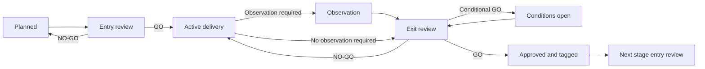
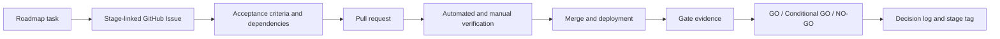

# Bookmarkt Stage-Gate Governance

| Field | Value |
| --- | --- |
| Governance version | 1.4 |
| Status | Active |
| Effective date | August 16, 2026 |
| Final gate authority | Bookmarkt product owner |

This document defines how the
[Bookmarkt Product Roadmap](PRODUCT_ROADMAP.md) is executed, changed, reviewed,
and approved.

## 1. Authority and source of truth

The project uses the following order of authority:

1. `docs/PRODUCT_ROADMAP.md` defines product goal, stage scope, dependencies, and
   exit outcomes.
2. `docs/STAGE_GATES.md` defines execution and approval rules.
3. `docs/DECISION_LOG.md` records accepted material decisions and exceptions.
4. `docs/gates/` contains the evidence and decision record for each gate.
5. GitHub Issues track executable work and acceptance criteria.
6. Pull requests and commits provide implementation and verification evidence.
7. Operational documents describe procedures for the deployed system.
8. Conversations and local task trackers are working context, not the permanent
   authority.

When records conflict, reconcile them through a documentation pull request and
record any material product change in the decision log.

## 2. Stage lifecycle



### Status definitions

| Status | Meaning |
| --- | --- |
| Planned | Scope is documented but delivery has not started |
| Entry review | Prerequisites are being evaluated |
| Active | Approved implementation and validation are underway |
| Observation | Delivery is complete but a required stability period is running |
| Gate review | Evidence is complete and a decision is requested |
| Complete | A `GO` decision is recorded |
| Deferred | Intentionally moved to a named later gate with accepted risk |
| Blocked | Cannot proceed without an unresolved dependency or decision |

## 3. Non-negotiable governance rules

1. Stages proceed in numerical order.
2. Research, design, or procurement for a later stage may begin early when it
   reduces lead time. This does not constitute stage entry.
3. Production implementation from the next stage waits for the current stage's
   recorded `GO`, unless an exception is approved.
4. Gate evidence must demonstrate the required outcome; completing an activity
   is not sufficient when the outcome has not been verified.
5. A P0 or P1 defect blocks an exit gate. A P0/P1 found during a stability window
   resets that window after the fix is deployed and verified.
6. Security, privacy, cross-account isolation, payment integrity, recovery, and
   store-policy requirements cannot be waived silently.
7. Deferred work must identify a destination gate, trigger for earlier action,
   owner, and accepted risk.
8. Every material roadmap change requires version-controlled documentation.
9. Gate approval belongs to the product owner. Engineering, design, security,
   legal/privacy, and operations provide evidence and recommendations within
   their domains.
10. A gate can be reopened if later evidence invalidates its assumptions.
11. No gate may redefine the v1 launch product as a public web/PWA reading
    application without an approved material roadmap decision superseding D-008.
12. No gate may expose an AI provider call based only on client state,
    authentication, or quota. An active server-authoritative paid feature
    entitlement is mandatory under D-011.

### Launch-channel invariant

- Bookmarkt v1 reading workflows ship through the native iOS and Android apps.
- A physical QR uses a Bookmarkt-controlled smart link.
- If Bookmarkt is installed, the QR opens the app through a Universal/App Link.
- If it is not installed, an iOS or Android user reaches the correct app store.
- Unsupported or desktop users may receive installation information.
- Minimal web infrastructure may provide routing, privacy, support, and required
  account functions, but not the reading application.
- Stage 1 PWA results remain valid prototype evidence. They do not establish the
  PWA as a launch requirement.

### Paid-AI entitlement invariant

- The v1 feature ladder is fixed and cumulative: Base includes AI Summary; Base+
  adds AI Character Mapping; Ultimate adds AI Image Generation.
- Base+ allows Summary, Character Mapping, or both in one generation session.
  Ultimate allows any one feature, any two, or all three in one generation
  session.
- The user can configure amount/detail separately for every selected feature
  within plan limits.
- When no paid subscription is active, the app displays Base, Base+, and Ultimate.
- A verified purchase enters the applicable paid stream. No selection or a
  canceled, abandoned, or failed purchase returns safely to manual entry.
- The backend validates user identity, active paid tier, entire requested feature
  set, and every required per-feature quota before contacting an AI provider.
- Entitlement/quota preflight is all-or-none. Authorized selected generators run
  concurrently where technically safe using one immutable reading boundary and
  one parent audit/session.
- Each selected feature has an independent result, approval, failure, and
  idempotent retry state; a partial failure does not erase successful siblings.
- A denied request consumes no generation quota and incurs no provider cost.
- Free/inactive users keep manual reading features and receive an upgrade path.
- Saved AI text/character artifacts belong to user-owned RLS rows; AI-generated
  images belong to private user-scoped Storage.
- Expanding the AI catalog requires a material roadmap decision.
- Changing tier names or their feature assignments requires a material roadmap
  decision; prices, billing periods, offers, and quotas remain Stage 4 decisions.

## 4. Work-item lifecycle



### GitHub Issue requirements

Use the repository's stage-task, bug, or gate-review issue form. Every executable
issue should identify:

- Stage and workstream.
- User/product outcome.
- Scope and explicit non-scope.
- Acceptance criteria.
- Dependencies and risks.
- Security, privacy, data, AI, payment, native, and store-policy impact.
- Verification evidence required for closure.
- Gate affected by the work.

Recommended title format:

```text
[S2][Architecture] Extract typed authentication service
[S3][UX] Add first-book onboarding
[S7][Beta] Validate purchase restoration on Android
```

### Pull request requirements

Every material pull request should:

- Name its stage and link its issue.
- Explain the outcome, not only the changed files.
- Identify migrations, configuration, security/privacy, billing, AI, native
  platforms, smart-link/store routing, prototype retirement, and accessibility
  impacts.
- Include the smallest sufficient automated and manual validation.
- Include rollout, monitoring, and rollback information when behavior changes.
- Update roadmap, operations, or user documentation when the source of truth
  changes.

A pull request can close a task but cannot approve a stage gate by itself.

## 5. Defect severity

| Severity | Definition | Gate effect |
| --- | --- | --- |
| P0 - Critical | Confirmed data exposure/loss, auth bypass, payment corruption, destructive security incident, or product-wide outage with no safe workaround | Immediate response; blocks gate; resets stability window |
| P1 - High | Core journey unavailable or unreliable for a meaningful group, persistent save/sync failure, incorrect account entitlement, or major supported-platform regression | Blocks gate; resets stability window when relevant |
| P2 - Medium | Important behavior is impaired but a safe workaround exists and data/security/payment integrity is intact | Must be triaged; may be explicitly accepted at gate |
| P3 - Low | Cosmetic, minor usability, or low-impact edge case | Prioritized through normal backlog |

AI output that is merely imperfect is not automatically P0/P1. A systematic
spoiler leak, unsafe content pattern, cross-user context leak, or unusable AI
workflow can be P0/P1 depending on scope and impact.

## 6. Gate evidence

Gate reviews should use direct evidence appropriate to the stage:

- Linked issues and merged pull requests.
- CI test, type-check, build, migration, and security results.
- iOS/Android real-device matrices, smart-link/store-routing tests, and
  supported-browser evidence only for the temporary prototype or minimal web
  endpoints.
- Production or beta monitoring windows.
- RLS, account-isolation, paid-tier/AI-feature entitlement, denied-provider-call,
  generated-artifact ownership, backup, restore, and deletion tests.
- Accessibility and usability findings.
- Store-policy, legal/privacy, and security reviews.
- Operational runbooks and incident simulations.
- Metrics with source, period, target, and actual result.
- Explicit residual risks and owner acceptance.

Evidence should avoid secrets and unnecessary user content.

## 7. Gate review process

1. Create a gate-review issue from the repository template.
2. Copy `docs/gates/GATE_REVIEW_TEMPLATE.md` to a stage-specific file.
3. Link all required evidence and list unresolved defects and risks.
4. Obtain domain recommendations required by that stage.
5. Record one decision:
   - **GO:** all mandatory criteria pass; the next stage may enter.
   - **CONDITIONAL GO:** only named, time-bound, non-critical conditions remain.
   - **NO-GO:** criteria do not pass; the stage remains active.
6. Record approver, date, conditions, and rationale.
7. Update the roadmap status and decision log in the same or follow-up pull
   request.
8. After a `GO`, create an annotated tag such as `stage-1-approved`.
9. Begin the next stage only after its own entry prerequisites are confirmed.

Conditional approval is prohibited when an unresolved condition involves a P0/P1,
confirmed cross-account exposure, payment integrity, mandatory legal/store
compliance, or unavailable required recovery controls.

## 8. Current gate register

| Stage | State | Entry | Exit | Gate record |
| --- | --- | --- | --- | --- |
| Foundation | Complete | N/A | Functional prototype deployed | Product roadmap history |
| Stage 1 | Observation | Approved | Pending, earliest August 23, 2026 | [Stage 1 review](gates/STAGE_1_REVIEW.md) |
| Stage 2 | Planned | Pending Stage 1 `GO` | Not started | To be created |
| Stage 3 | Planned | Pending Stage 2 `GO` | Not started | To be created |
| Stage 4 | Planned | Pending Stage 3 `GO` | Not started | To be created |
| Stage 5 | Planned | Pending Stage 4 `GO` | Not started | To be created |
| Stage 6 | Planned | Pending Stage 5 `GO` | Not started | To be created |
| Stage 7 | Planned | Pending Stage 6 `GO` and mandatory Pro controls | Not started | To be created |
| Stage 8 | Planned | Pending Stage 7 `GO` | Not started | To be created |
| Stage 9 | Planned | Pending launch | Ongoing | Recurring release reviews |

## 9. Stage 1 gate policy

Stage 1 is in an observation period after all identified production-phone flows
passed on August 16, 2026 at 10:55 MDT (16:55 UTC).

The gate may be reviewed on or after August 23, 2026 at 10:55 MDT (16:55 UTC),
after seven consecutive 24-hour periods, if:

- No P0/P1 defect occurred during seven full consecutive days.
- Authentication, save, switch-book, AI, image, and account-isolation behavior
  remains reliable.
- Any P2/P3 findings are documented and assigned.
- The product owner explicitly approves Stage 2 entry.

Supabase Pro backups and leaked-password protection are accepted deferrals to the
Stage 7 entry gate. This is not permission to invite external beta users without
those controls.

Stage 1 approval validates the temporary PWA and shared backend as a behavioral
baseline for the native rebuild. It does not approve a public PWA reading product
for beta or launch.

Stage 1 AI evidence validates authentication, quotas, and operational logging
only. The prototype does not implement subscriptions, so it does not approve the
launch paid-AI entitlement model required by D-011 and Stage 4.

## 10. Change control

### Material change

A change is material when it affects any of the following:

- Product goal, target user, initial v1 boundaries, or stage order.
- A stage's mandatory entry or exit criteria.
- QR identity, app/store routing, account ownership, data model, launch channel,
  PWA retirement, supported platform, or native strategy.
- Subscription, pricing, paid-AI feature matrix, entitlement, payment provider,
  or app-store policy.
- Security, privacy, retention, backup, deletion, AI catalog/safety, or legal
  posture.
- Launch threshold, supported region, age eligibility, or accepted risk.

### Required process

1. Describe the problem and options.
2. Identify affected stages, costs, risks, and dependencies.
3. Record the proposed decision and alternatives in `DECISION_LOG.md`.
4. Update all impacted roadmap and gate documents in one pull request.
5. Obtain product-owner approval before treating the change as active.
6. Update affected issues only after the authoritative documents merge.

Minor wording, links, evidence, and implementation detail that do not change
scope or gate criteria do not require a new decision entry.

## 11. Exception process

An exception request must state:

- Rule or gate criterion being bypassed.
- Business reason and deadline.
- Risk and worst credible outcome.
- Compensating controls.
- Named owner and expiration.
- Required follow-up work and destination stage.
- Product-owner decision.

Expired exceptions automatically become blockers. Permanent exceptions require a
roadmap change rather than repeated extensions.

## 12. Cadence

| Cadence | Activity |
| --- | --- |
| During active development | Keep issues and PRs linked to the active stage |
| Weekly | Review stage progress, blockers, decisions, and newly discovered risks |
| Before every gate | Reconcile roadmap, gate record, issues, evidence, and operations docs |
| After every gate | Record decision, update status, and tag the approved baseline |
| During beta/launch | Review operational indicators and P0/P1 findings daily |
| Stage 9 | Monthly product/reliability review and quarterly roadmap/risk review |

## 13. Document ownership and maintenance

- The product owner owns product goal, priority, pricing, accepted risk, and gate
  decisions.
- Engineering owns technical evidence, reproducibility, testing, deployment, and
  rollback.
- Design owns user research, usability, design-system, and accessibility evidence.
- Legal/privacy specialists validate legal conclusions and disclosures.
- Operations/support own monitoring, incident, report-review, and support
  readiness.

One person may initially fill several roles, but the evidence and decision must
remain explicit.
